# Developer Guide

# Introduction

CardLI is a Command Line Interface (CLI) desktop app designed to help students manage their flashcards. CardLI can help
students keep track of all their flashcards. It also allows students to test their knowledge. All of this in one
single platform.

## Acknowledgements

{list here sources of all reused/adapted ideas, code, documentation, and third-party libraries -- include links to the
original source as well}

## Design
CardLi has one main component, ```Main```, consisting of one class `CardLi`. It is responsible for:

<li> At app launch: initialises the components in the correct sequence, and connects them up with each other</li>

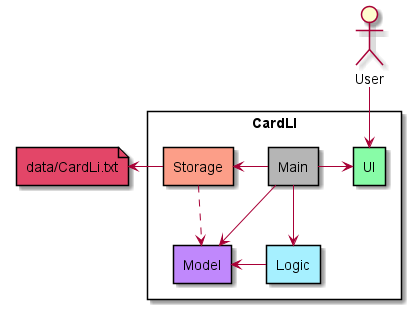

The rest of the App consists of the following components:
* ```Model```: Holds the data of the App in memory.
* ```UI```: The UI of the App
* ```Logic```: The command executor
* ```Storage```: Reads and writes data from and to an external file(s)

Each component is explained in the sections below.

### Model Component


The `Model` component consists of two packages: 

The `flashcard` package that contains:
<li> DeckManager</li>
<li> Deck </li>
<li> FlashCard</li>
<br>

and the `testing` package that contains:
<li> Answer</li>
<li> TestManager</li>
<li> TestHistory</li>
<li> TestManager</li>
<li> Countdown</li>

A `Deck` contains a private arrayList of `FlashCards`, and `DeckManager` contains a private arrayList of `Decks`.

### UI Component
The UI component consists of two classes, ```CardLiUi``` and ```TestUi```. It outputs greeting, exit and help messages to the user on command.

### Logic Component

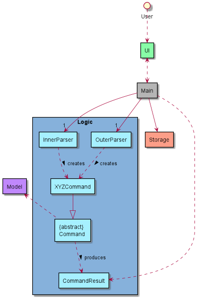

Here is a partial architecture diagram of the `Logic` component. It executes user commands via Command classes when appropriate with the appropriate arguments as given by the Parser component.

CardLi’s user commands operate on a 2-tier structure: a Systemwide level and a Deck level. The Systemwide level commands execute commands related to the management of decks, while the Deck level commands execute commands related to flashcards in a specific deck. The specific implementations are elaborated on in the *Implementation* section.

How the `Logic` component works:
1. When `Main` is called upon to execute a command, `Inner Parser` or `Outer Parser` parses the user input to get the command word. 
2. According to the command word a subclass of the `Command` object (eg. `AddCardsCommand`, `DeleteDeckCommand`) which is executed by Main/
3. The command communicates with the `Model` when it is executed (eg. to add a flashcard).
4. The result of the command execution is encapsulated as a `CommandResult` object which is returned to the `UI` from `Logic` to process.


Above is the architecture diagram containing the parser classes in `Logic` that are used for parsing a user command.

How the parsing works:

`Inner Parser` or `Outer Parser` creates a `XYZCommand` which in turn creates its corresponding `XYZCommandParser` (eg. when `InnerParser` creates a `EditCardCommand`, `EditCardCommand` creates a `EditCardParser`.)</li>

All `XYZCommandParser` classes implement the `CommandArgumentParser` interface.
### Storage Component
The Storage component:
* Saves all the decks
* Saves all the flashcards
* Remembers which deck each flashcard belongs to
* Saves the results of each test

## Implementation
### Edit

This subsection provides details on the implementation of the commands that enable the editing of the `Deck` object.

The user can only edit the `name` attribute of the `Deck` object, which represents the name of the deck.

### `EditDeckCommand`


Given below is the sequence diagram for `edit` (Deck):

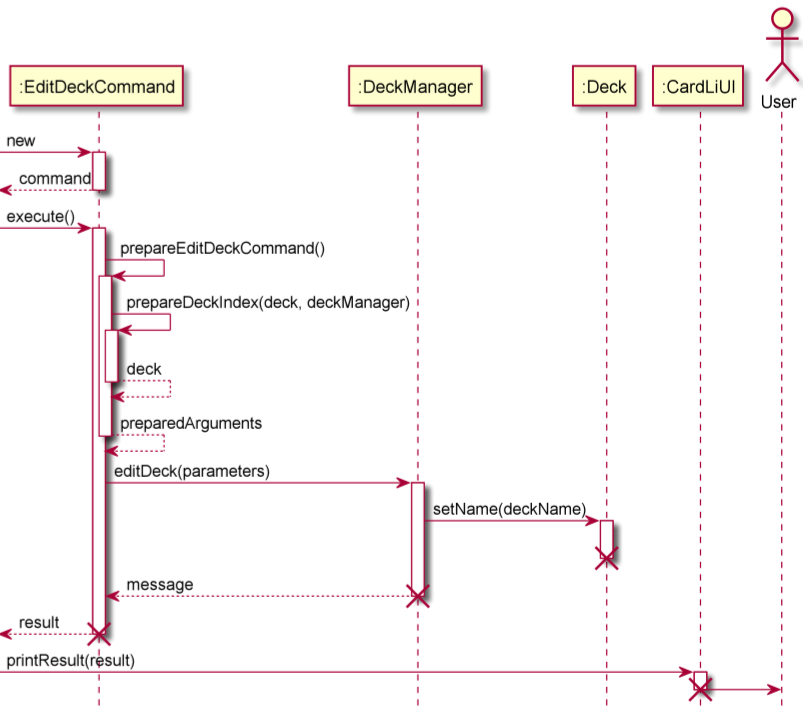

The `EditDeckCommand` allows the changing of the name of the `Deck`.

By entering the edit command in the `OuterParser` class, an `EditDeckCommand` object is created and its constructor is
called. This object is returned to `CardLi` class, which then calls the `execute()` method
of the `EditDeckCommand` object.

The `execute()` method in the `EditDeckCommand` class self-invokes the `prepareEditDeckCommand()` method, which helps
the handling of edge cases as well as format the method arguments. In turn, `prepareEditDeckCommand()` self-invokes the
`prepareDeckIndex` method, which handles the formatting of the deck index specified by the user. `prepareDeckIndex()` 
returns `deck`, of string type, which represents the deck to be edited. `prepareEditDeckCommand()` will then return
a string array, `preparedArguments`, which represents the arguments for the next method call.

The `execute()` method will then call the `editDeck()` method of the `DeckManager` class, which in turn calls the 
`setName()` method of the `Deck` class. Once `editDeck()` is completed, a message of string type is returned to the
`execute()` method. The message is stored in a `CommandResult` class, which is then returned to `CardLi`.

`CardLi` then calls upon the `printResult()` method of the `CardLiUI` class to print the message to the user.

### `EditCardCommand`

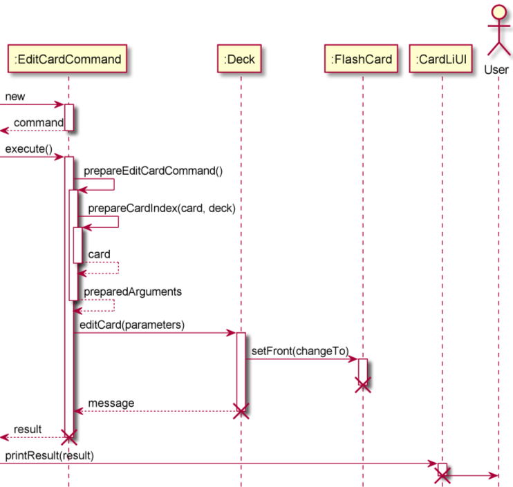

The `EditCardCommand` allows the changing of the content of the `FlashCard`. The user can decide to change either the `front`
or `back` attributes of the `FlashCard`object, which represents the front and back side of the card.

By entering the edit command in the `InnerParser` class, an `EditCardCommand` object is created and its constructor is
called. This object is returned to `CardLi` class, which then calls the `execute()` method
of the `EditCardCommand` object.

The `execute()` method in the `EditCardCommand` class self-invokes the `prepareEditCardCommand()` method, which helps
the handling of edge cases as well as format the method arguments. In turn, `prepareEditClardCommand()` self-invokes the
`prepareCardIndex` method, which handles the formatting of the card index specified by the user. `prepareCardIndex()`
returns `card`, of string type, which represents the card to be edited. `prepareEditCardCommand()` will then return
a string array, `preparedArguments`, which represents the arguments for the next method call.

The `execute()` method will then call the `editCard()` method of the `Deck` class, which in turn calls the
`setFront()` or `setBack()` method of the `FlashCard` class. Once `editCard()` is completed, a message of string type is returned to the
`execute()` method. The message is stored in a `CommandResult` class, which is then returned to `CardLi`.

`CardLi` then calls upon the `printResult()` method of the `CardLiUI` class to print the message to the user.

### Move

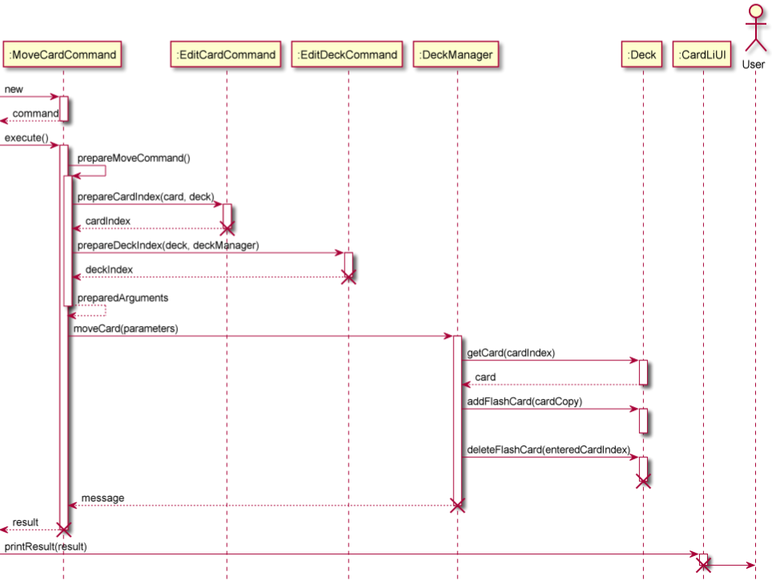

This subsection provides details on the implementation of the `moveCardCommand`. This command
enables moving of a card in a deck the user is currently in to another deck.

By entering the edit command in the `InnerParser` class, an `MoveCardCommand` object is created and its constructor is
called. This object is returned to `CardLi` class, which then calls the `execute()` method
of the `MoveCardCommand` object.

The `execute()` method in the `MoveCardCommand` class self-invokes the `prepareMoveCardCommand()` method, which helps
the handling of edge cases as well as format the method arguments. In turn, `prepareMoveCardCommand()` self-invokes the
`prepareCardIndex` method, which handles the formatting of the card index specified by the user. After this, `prepareMoveCardCommand()`
self invokes the `prepareDeckIndex` method, which handles the formatting of the deck index specified by the user.`prepareCardIndex()`
returns `card`, of string type, which represents the card to be edited. `prepareDeckIndex()`
returns `deck`, of string type, which represents the deck to be edited.`prepareMoveCommand()` will then return
a string array, `preparedArguments`, which represents the arguments for the next method call.

The `execute()` method will then call the `moveCard()` method of the `DeckManager` class, which in turn calls the
`getCard()` method of the `Deck` class to get a copy of the card to be moved. `DeckManager` then calls the `addFlashCard()`
method of the `Deck` class to add the card to the deck specified by the user. Next, `DeckManager` calls the `deleteFlashCard()`
method of the `Deck` class to delete the card from the deck it was from. Once `moveCard()` is completed, a message of string type is returned to the
`execute()` method. The message is stored in a `CommandResult` class, which is then returned to `CardLi`.

`CardLi` then calls upon the `printResult()` method of the `CardLiUI` class to print the message to the user.

### Find

This feature allows users of CardLI to find a `FlashCard` by providing a search term to the input following the command term `find`. By invoking this function the user can view specific `FlashCards` matching the search term from the main menu, instead of entering each **Deck** and manually looking through the list of **FlashCard** for the desired ones.

Currently, `find` is implemented on a Systemwide level. After the `CardLiUi` handles the user input, `OuterParser` formats the user input and creates a `FindCardsCommand` object which is returned. `Duke` calls the `execute()` method of the `FindCardsCommand` object. The `FindCardsParser` extracts the search term(s) and passes them to `CommandResult` which invokes the  `findCards()` method of `DeckManager` that repeatedly calls the `returnMatchingFlashCards()` method that iterates once for each instance of a `Deck`.

`returnMatchingFlashCards()` is implemented by creating a stream that consists of all the `FlashCards` from one deck, and filters them based on whether they contain the search term given. Finally all the `FlashCards` that contain the search term are collected in an arrayList and their console outputs are returned in string format for `CardLiUi` to display to the user.

Given below is the sequence diagram for `find`:

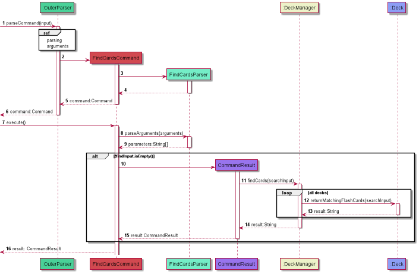


### Test Feature

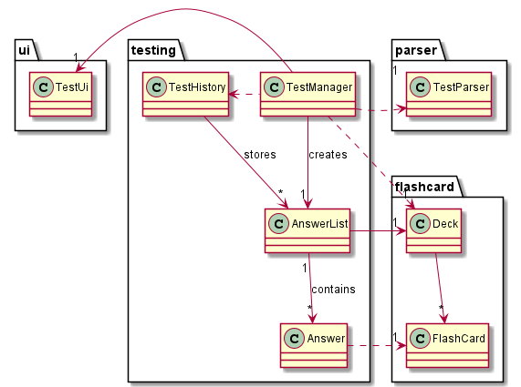

Currently, test feature is implemented on a systemwide level and is handled by `TestManager`.
`TestManager` will call on `TestUi` and `TestParser` to handle the inputs and outputs with the user
and the parsing respectively during the test.

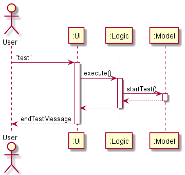

To enter into test mode, the user needs to enter `test` in main menu in which the program will
prompt the user to input a number corresponding to the index of the deck that they want to 
be tested on or "all" to test all decks.

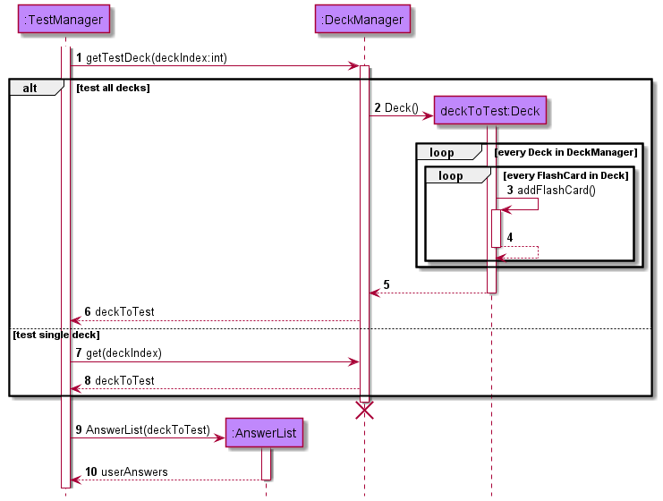

In both cases, `TestManager` will create an `AnswerList` using a `Deck` that it creates or gets from
`DeckManager` depending on the condition which is shown by the sequence diagram above. 
If the user decides to test all decks, the program will compile all `FlashCard` into a `Deck`. If the user
decides to test a single deck, the program will get that deck instance from `DeckManager`.
The `AnswerList` is where the user's response to the test is stored, and it is made up 
of `Answer` as shown in the class diagram above. The `AnswerList` is also tagged with the test deck.

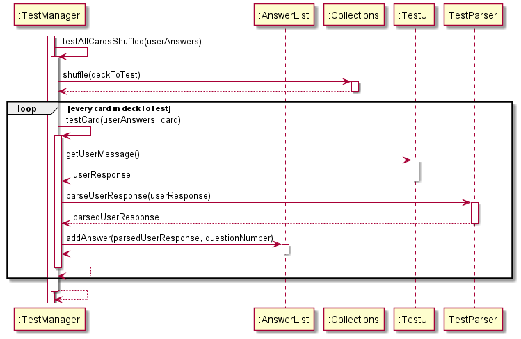

After initializing the `AnswerList`, the testing begins. The `Deck` gets shuffled, then the cards (question)
will be printed one at a time for the user to answer. The user's answer is then parsed and then added into
the `AnswerList`. This process is repeated for the entire `Deck` that is being tested.


After all cards have been tested, the marking process begins as shown by the sequence diagram above. The
program will print the question, followed by the actual answer, followed by the user's answer.
For every correct answer, the user's score increments and `TestUi` will print a correct answer message.
After marking all the questions, the user's results will be printed and saved in `TestHistory`.
This concludes the entire `startTest()` process.

The `startReview()` process is similar to `startTest()`, except the `getTestDeck()` function has an additional
condition of the `FlashCard` getting less than 50% of the total number of tests. 
 
### Storage

This feature allows users of CardLI to save data on their current decks of flashcards as well as
the tests that they have completed thus far. This will also allow users to re-access the data
when they re-enter the application. This way, they will not have to keep re-adding the same flashcards,
while also being able to review tests that they had previously done on the application. 

This feature is implemented by saving the user’s data into two separate text files, which will be saved into
a new `data` directory created upon first start up of the application if it does not yet exist. 
This new directory will be created within the current directory from which the `CardLI.jar` file is run in the CLI. 
The file paths of the two text files are hard coded as `Cards_CardLI.txt` and `Tests_CardLItxt`, which will save data
on the user's decks of flashcards and test history respectively. 
When the user inputs the command `bye`, the application execute the save functions. When the 
user restarts or re-enters the application, the application will parse the text files and convert them into
the relevant data. The format of how the data is saved into the text files are specified 
during the development process in order to reduce the risk of bugs arising when the text files are being parsed, which
will be explained in the following paragraphs.

A `Storage` class was implemented to contain all the methods to execute the save and parse functions to and from the 
relevant text files. An instance of this class is created upon first start up the application to handle all the 
method calls. The respective methods will be explained in more detail in the following paragraphs.

`writeToFile(ArrayList<T> arrayList, String type)`

This method invokes the save function by writing the user's data to the specified text files. It takes in two arguments,
namely an `ArrayList` of a generic type `<T>` as well as a `boolean` value, `saveCards`, that indicates whether the method
is saving cards or tests to their respective text files.

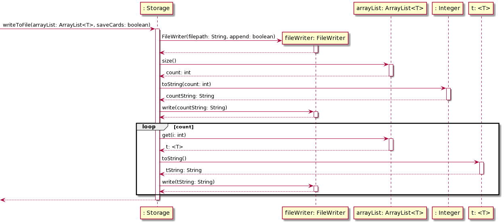

For the saving of the user's decks of flashcards, the method call will expect an `ArrayList` of `Deck` objects along 
with a `saveCards` argument of true. 
The `toString()` methods within the `Deck`and `Flashcard` classes have been overridden as per the specified format
of saving the decks of flashcards to the text file. 
For a `Flashcard` instance, the `toString()` method outputs a formatted string: `<front> | <back> | <userScore> 
| <totalScore>`. For a `Deck` instance, the `toString()` method also outputs a formatted string containing information 
about the deck name, the number of flashcards within the deck, on top of information on each of the flashcards contained
within the deck. An example of the format of the `Cards_CardLI.txt` where the decks of flashcards are saved is shown 
in the screenshot below.


For the saving of the user's test history, the method call will expect an `ArrayList` of `AnswerList` objects along
with a `saveCards` argument of false.
The `toString()` methods within the `AnswerList`and `Answer` classes have been overridden as per the specified format
of saving the test history to the text file.
For a `Answer` instance, the `toString()` method outputs a formatted string: `<answer> | <questionIndex>`. 
For a `AnswerList` instance, the `toString()` method also outputs a formatted string containing information
about the test deck and the user's test score, on top of information on each of the user's answers for the test. 
An example of the format of the `Tests_CardLI.txt` where the decks of flashcards are saved is shown
in the screenshot below.


`readCardsFromFile()` and `readTestsFromFile()`

These two methods are executed every time the CardLI application is opened.
The methods use an instance of the `Scanner` class to parse through the text files line by line. 
As per the saving format explained in the `writeToFile()` method above, the 
`readCardsFromFile()`/`readTestsFromFile()` methods essentially reverse engineer the process to save the user's 
data into the application before any commands are given from the user. The individual methods
will be explained in more detail in the following paragraphs.

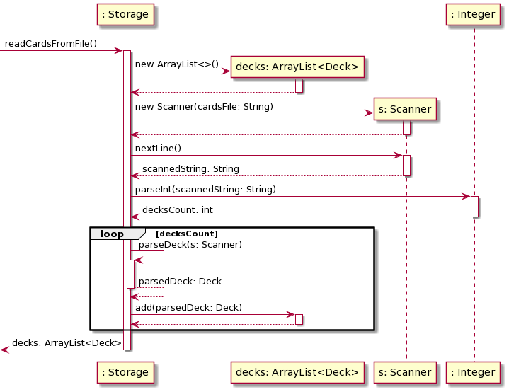

The `readCardsFromFile()` method reads from the `Cards_CardLI.txt` file.
A generic instance of this method will be explained using the screenshot of the respective file given 
above.
Once the method is invoked, a new instance of an `ArrayList`  of `Deck` instances, called `decks`, 
is created to store the `Deck` instances that are parsed from the text file.
Line 1 is parsed as the number of `Deck` instances that are expected within the text file.
Then, Lines 2-5 represent the first `Deck` instance while lines 6-8 represent the second `Deck` instance.
Since the decks are saved in a pre-determined format within the text files, the `parseDeck(Scanner s)` 
method has been abstracted to parse decks from the text file and convert them to `Deck` instances
to be returned from the method. 
For each of the `Deck` instances, the first line is parsed as the name of the deck.
The second line is then parsed as the number of flashcards to expect within the deck.
The remaining lines of each `Deck` instance is parsed as a flashcard each by splitting the parsed line based on the
regular expression, `" | "`. 
All the parsed data is converted to the relevant data types and passed as arguments to form a `Deck` 
instance.
Lastly, all the individually parsed `Deck` instances are added to the `decks` variable and returned from
the method. 

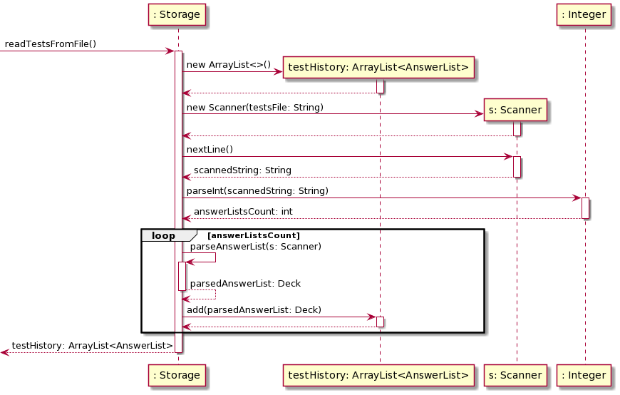

The `readTestsFromFile()` method reads from the `Tests_CardLI.txt` file.
A generic instance of this method will be explained using the screenshot of the respective file given
above.
Once the method is invoked, a new instance of an `ArrayList` of `AnswerList` instances, called 
`testHistory`, is created to store the `AnswerList` instances that are parsed from the text file.
Line 1 is parsed as the number of `AnswerList` instances that are expected within the text file.
Lines 2-9 represent the 1 `AnswerList` instance that is expected within this text file.
Since the answer lists are saved in a pre-determined format within the text files, the 
`parseAnswerList(Scanner s)` method has been abstracted to parse answer lists from the text file and 
convert them to `AnswerList` instances to be returned from the method. 
For each of the `AnswerList` instances, the `parseDeck` method explained in the previous section
is first called to parse a `Deck` instance from the text file, representing the deck of flashcards
for which the answers correspond to. This is seen in lines 2-5 in the screenshot provided.
The next line is parsed as the number of answers that are expected for the answer list.
Subsequently, 1 line is read for each answer that is expected, where the parsed line is split based on the
regular expression, `" | "`.
The last line of each `AnswerList` instance is parsed as the score obtained by the user for the answer list.
All the parsed data is converted to the relevant data types and passed as arguments to form a `AnswerList` instance.
Lastly, all the individually parsed `AnswerList` instances are added to the `testHistory` variable and
returned from the method. 

## Product scope

### Target user profile

* Pre-University/University/Polytechnic students
* Reasonably comfortable using CLI apps
* Types fast
* Prefers to store their information online rather than physically
* Has a lot of flashcards


### Value proposition

CardLI provides a:
<li> User-friendly </li>
<li> Storage efficient</li>
<li> Internet connection independent flashcard experience.

## User Stories

|Version| As a ... | I want to ... | So that I can ...|
|--------|----------|---------------|------------------|
|v1.0|new user|see usage instructions|refer to them when I forget how to use the application|
| |user| add flashcards|
| |user| delete flashcards|
| |user| view my flashcards|know what cards I currenly have in the deck|
| |user| test myself with my flashcards|know if I have memorised the flashcards correctly|
| |student preparing for their exam|see a list of the flashcards I got wrong|know which concepts I do not know|
|v2.0|user|shuffle my flashcards|test myself with a different order of flashcards each time|
| |student in a hurry|edit my flashcards|change the front or back of a flashcard without deleting and adding it again
| |student who studies multiple subjects|organise my flashcards into different decks|keep flashcards with related topics in the same set|
| |student preparing for their exam|see a timer when in test mode|keep track of how much time I have spent on each question
| |student who wants to test themself|to see the percentage of correct answers for each flashcard|which cards I am less proficient in
| |student in a hurry|test myself with the flashcards I have answered wrongly for more than half the time|get more proficient at the concepts I am not familiar with
| |student with many flashcards and decks|find a flashcard by searching for a term matching it|find the flashcard without looking through all my decks
| |student with little time|save my flashcards|I do not have to add my flashcards to the app every time I use it

## Non-Functional Requirements

{Give non-functional requirements}

## Glossary

* *glossary item* - Definition

## Instructions for manual testing

{Give instructions on how to do a manual product testing e.g., how to load sample data to be used for testing}
