# Developer Guide


## Content

1. [Introduction](#1-introduction)<br/>
2. [Acknowledgements](#2-acknowledgements)<br/>
3. [Design](#3-design)<br/>
   3.1. [Model Component](#31-model-component)<br/>
   3.2. [UI Component](#32-ui-component)<br/>
   3.3. [Logic Component](#33-logic-component)<br/>
   3.4. [Storage Component](#34-storage-component)<br/>
4. [Implementation](#4-implementation)<br/>
   4.1. [Edit](#41-edit)<br/>
   &nbsp;&nbsp;&nbsp;&nbsp;4.1.1 [EditDeckCommand](#411-editdeckcommand)<br/>
   &nbsp;&nbsp;&nbsp;&nbsp;4.1.2 [EditCardCommand](#412-editcardcommand)<br/>
   4.2. [Move](#42-move)<br/>
   4.3. [Find](#43-find)<br/>
   4.4. [Test Feature](#44-test-feature)<br/>
   &nbsp;&nbsp;&nbsp;&nbsp;4.4.1 [Test Setup](#441-test-setup)<br/>
   &nbsp;&nbsp;&nbsp;&nbsp;4.4.2 [Testing Process](#442-testing-process)<br/>
   4.5. [Storage](#45-storage)<br/>
   &nbsp;&nbsp;&nbsp;&nbsp;4.5.1. [Writing to JSON files](#451-writing-to-json-files)<br/>
   &nbsp;&nbsp;&nbsp;&nbsp;4.5.2. [Reading from JSON files](#452-reading-from-json-files)<br/>
   &nbsp;&nbsp;&nbsp;&nbsp;&nbsp;&nbsp;&nbsp;&nbsp;4.5.2.1. [ReadCardsFromFile](#4521-readcardsfromfile)<br/>
   &nbsp;&nbsp;&nbsp;&nbsp;&nbsp;&nbsp;&nbsp;&nbsp;4.5.2.2. [ReadTestFromFile](#4522-readtestfromfile)<br/>
5. [Product Scope](#5-product-scope)<br/>
   5.1. [Target User Profile](#51-target-user-profile)<br/>
   5.2. [Value Proposition](#52-value-proposition)<br/>
6. [User Stories](#6-user-stories)<br/>
7. [Non-Functional Requirements](#7-non-functional-requirements)<br/>
8. [Glossary](#8-glossary)<br/>
9. [Instructions for Manual Testing](#9-instructions-for-manual-testing)<br/>
   9.1. [Main Menu](#91-main-menu)<br/>
   9.2. [Deck Mode](#92-deck-mode)<br/>

## [1. Introduction](#content)

CardLI is a Command Line Interface (CLI) desktop app that helps students manage their flashcards. It also allows
students to test and review their knowledge. All of this in one single platform.

## [2. Acknowledgements](#content)

* [__AB3:__](https://se-education.org/addressbook-level3/) For reference regarding the user guide and developer guide
* [__Jansi:__](https://mvnrepository.com/artifact/org.fusesource.jansi/jansi) For its ANSI escape sequence library,
  currently used in flashcard testing
* [__JSON.simple__](https://mvnrepository.com/artifact/com.googlecode.json-simple/json-simple) For saving and storing
  JSON objects.

## [3. Design](#content)

CardLi has one main component, ```Main```, consisting of one class `CardLi`. It is responsible for:

<li> At app launch: initializing the components in the correct sequence, and connecting them up with each other</li>


The rest of the App consists of the following components:

* ```Model```: Holds the data of the App in memory.
* ```UI```: The UI of the App
* ```Logic```: The command executor
* ```Storage```: Reads and writes data from and to external files

Each component is explained in the sections below.

### [3.1. Model Component](#content)

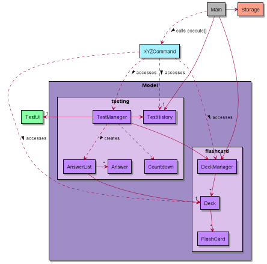

The `Model` component consists of two packages, `flashcard` and `testing`.

The `flashcard` package contains:
<li> DeckManager</li>
<li> Deck </li>
<li> FlashCard</li>
<br>

The `testing` package contains:
<li> Answer</li>
<li> TestManager</li>
<li> TestHistory</li>
<li> TestManager</li>
<li> Countdown</li>

A `Deck` contains a private ArrayList of `FlashCards`, and `DeckManager` contains a private ArrayList of `Decks`.

An `AnswerList` contains a private ArrayList of `Answers`, which is created by `TestManager` when the commands for the
test functions are executed (`ReviewCommand`, `TestCommand`).

The `Countdown` class creates a timer that displays the time left for a question during a Test or Review.

### [3.2. UI Component](#content)

The UI component consists of two classes, ```CardLiUi``` and ```TestUi```.

` CardLiUi` outputs greeting messages, exit messages, help messages and command results to the user on command. It takes
in input from the user when the program is not in Test or Review.

`TestUi` handles the input and output for the Test and Review functions. More details are explained in the
implementation section for Test.

### [3.3. Logic Component](#content)

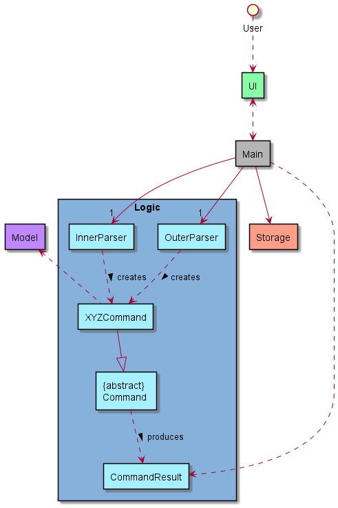

> ℹ️  `XYZCommand` is a placeholder name for subclasses of the abstract `Command` class (e.g. `AddCardsCommand`, `DeleteDeckCommand`, `TestCommand`, etc.)

The above diagram is a partial architecture diagram of the `Logic` component. It executes user commands via Command
classes with the appropriate arguments as given by the Parser classes.

CardLi’s user commands operate on a 2-tier structure: a Systemwide level and a Deck level. The Systemwide level commands
execute commands related to the management of decks, testing and reviewing, while the Deck level commands execute
commands related to flashcards in a specific deck. The specific implementations are elaborated on in the *
Implementation* section.

How the `Logic` component works:

1. When `Main` is called upon to execute a command, `Inner Parser` or `Outer Parser` parses the user input to get the
   command word.
2. According to the command word, a subclass of the `Command` object (e.g. `AddCardsCommand`, `DeleteDeckCommand`, etc.)
   is created.
3. The command communicates with the `Model` when it is executed (e.g. to add a flashcard).
4. The result of the command execution is encapsulated as a `CommandResult` object which is returned to the `UI`
   from `Logic` to be processed.

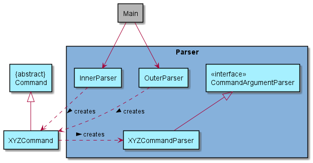

The architecture diagram above contains the parser classes in `Logic` that are used for parsing a user command.

How the parsing works:

`Inner Parser` or `Outer Parser` creates a `XYZCommand` which in turn creates its corresponding `XYZCommandParser`
(e.g. when `InnerParser` creates a `EditCardCommand`, `EditCardCommand` creates a `EditCardParser`.)

All `XYZCommandParser` classes implement the `CommandArgumentParser` interface.

### [3.4. Storage Component](#content)

The `Storage` component:

* Saves all the decks
* Saves all the flashcards
* Saves all the flashcard scores
* Remembers which deck each flashcard belongs to
* Saves the results of each test

All app data is saved as JSON files.

## [4. Implementation](#content)

> ℹ️ Note: In the sequence diagrams below, the lifeline for objects should end at the destroy marker (X) but due
> to a limitation of PLANTUML, the lifeline reaches the end of the diagram.

### [4.1. Edit](#content)

This subsection provides details on the implementation of the commands that enable the editing of the `Deck`
and `FlashCard` objects.

#### [4.1.1. `EditDeckCommand`](#content)

Given below is the sequence diagram for `edit` (Deck):

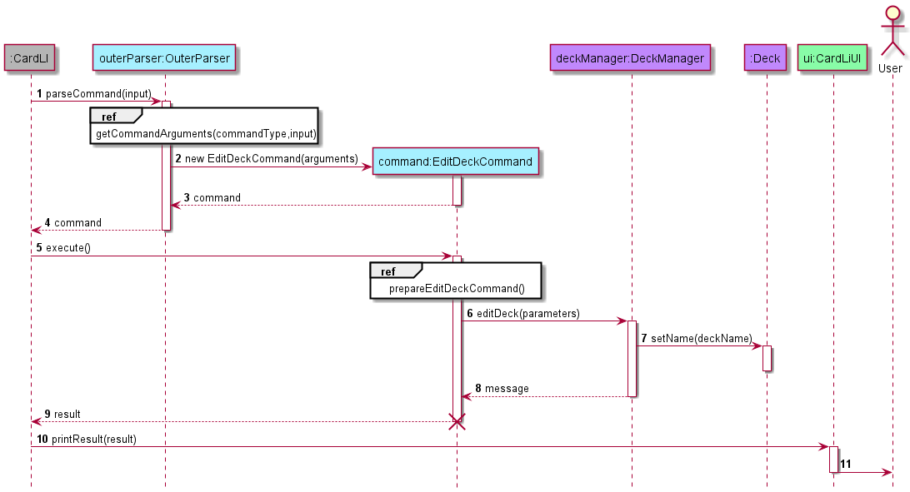

The `EditDeckCommand` allows the changing of the name of the `Deck`. The user can only edit the `name` attribute of the
`Deck` object, which represents the name of the deck.

By entering the `edit` command in the `OuterParser` class, an `EditDeckCommand` object is created and its constructor is
called. This object is returned to `CardLi` class, which then calls the `execute()` method of the `EditDeckCommand`
object.

The `execute()` method in the `EditDeckCommand` class self-invokes the `prepareEditDeckCommand()` method, which helps
the handling of edge cases as well as format the method arguments. In turn, `prepareEditDeckCommand()` self-invokes the
`prepareDeckIndex` method, which handles the formatting of the deck index specified by the user. `prepareDeckIndex()`
returns `deck`, of string type, which represents the index of the deck to be edited. `prepareEditDeckCommand()` will
then return a string array, `preparedArguments`, which represents the arguments for the next method call.

The `execute()` method will then call the `editDeck()` method of the `DeckManager` class, which in turn calls the
`setName()` method of the `Deck` class. Once `editDeck()` is completed, a message of string type is returned to the
`execute()` method. The message is stored in a `CommandResult` class, which is then returned to `CardLi`.

`CardLi` then calls upon the `printResult()` method of the `CardLiUi` class to print the message to the user.

#### [4.1.2. `EditCardCommand`](#content)

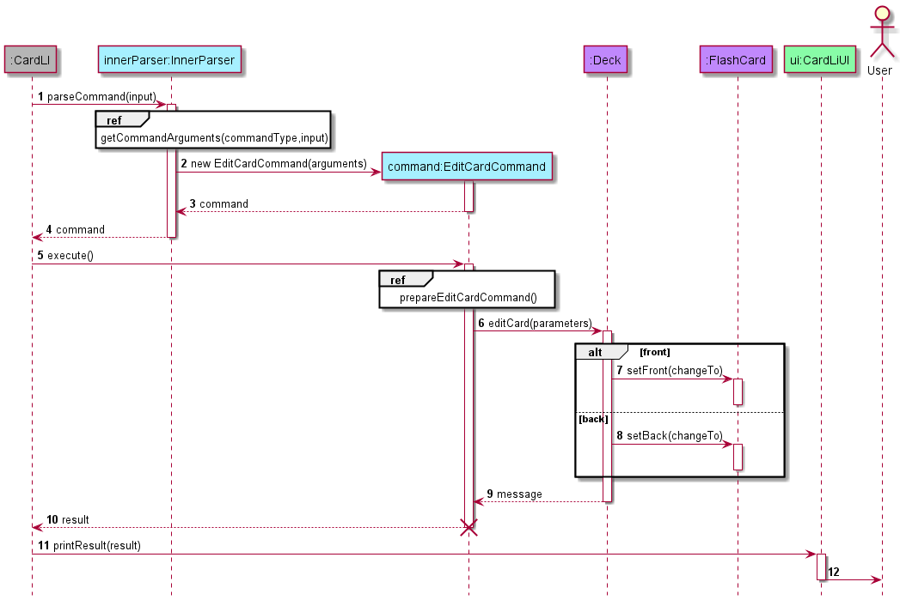

The `EditCardCommand` allows the changing of the content of the `FlashCard`. The user can decide to change either
the `front`
or `back` attributes of the `FlashCard`object, which represents the front and back side of the card.

By entering the edit command in the `InnerParser` class, an `EditCardCommand` object is created and its constructor is
called. This object is returned to `CardLi` class, which then calls the `execute()` method of the `EditCardCommand`
object.

The `execute()` method in the `EditCardCommand` class self-invokes the `prepareEditCardCommand()` method, which helps
the handling of edge cases as well as format the method arguments. In turn, `prepareEditCardCommand()` self-invokes the
`prepareCardIndex` method, which handles the formatting of the card index specified by the user. `prepareCardIndex()`
returns the index of the card to be edited as a string. `prepareEditCardCommand()` will then return a string array,
`preparedArguments`, which represents the arguments for the next method call.

The `execute()` method will then call the `editCard()` method of the `Deck` class, which in turn calls the
`setFront()` or `setBack()` method of the `FlashCard` class. Once `editCard()` is completed, a message of string type is
returned to the `execute()` method. The message is stored in a `CommandResult` class, which is then returned to
`CardLi`.

`CardLi` then calls upon the `printResult()` method of the `CardLiUi` class to print the message to the user.

### [4.2. Move](#content)

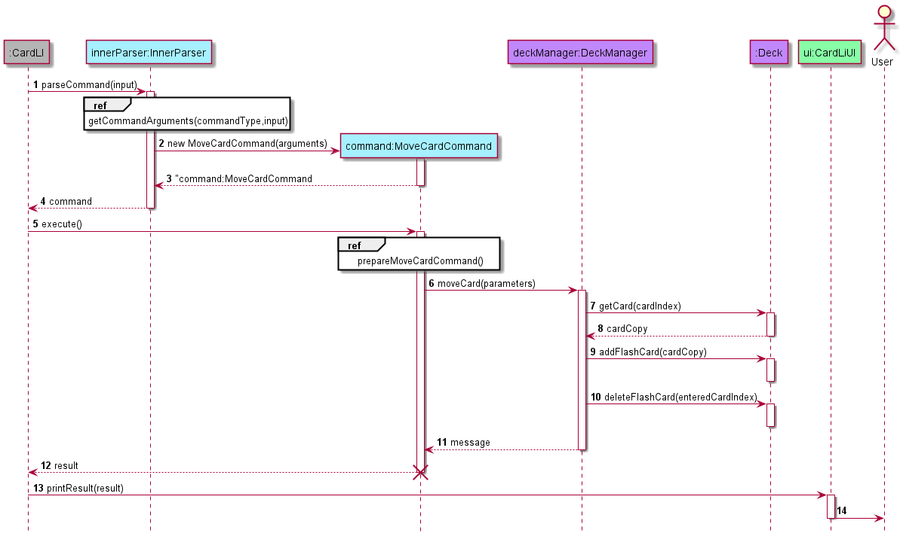

This subsection provides details on the implementation of the `moveCardCommand`. This command enables moving of a card
in a deck the user is currently in to another deck.

By entering the move command in the `InnerParser` class, an `MoveCardCommand` object is created and its constructor is
called. This object is returned to `CardLi` class, which then calls the `execute()` method of the `MoveCardCommand`
object.

The `execute()` method in the `MoveCardCommand` class self-invokes the `prepareMoveCardCommand()` method, which helps
the handling of edge cases as well as format the method arguments. In turn, `prepareMoveCardCommand()` self-invokes the
`prepareCardIndex` method, which handles the formatting of the card index specified by the user. After this,
`prepareMoveCardCommand()` self invokes the `prepareDeckIndex` method, which handles the formatting of the deck index
specified by the user.`prepareCardIndex()` returns `card`, of string type, which represents the index of the card to be
edited. `prepareDeckIndex()`returns `deck`, of string type, which represents the index of the deck to be edited.
`prepareMoveCommand()` will then return a string array, `preparedArguments`, which represents the arguments for the next
method call.

The `execute()` method will then call the `moveCard()` method of the `DeckManager` class, which in turn calls the
`getCard()` method of the `Deck` class to get a copy of the card to be moved. `DeckManager` then calls the
`addFlashCard()` method of the `Deck` class to add the card to the deck specified by the user. Next, `DeckManager` calls
the `deleteFlashCard()` method of the `Deck` class to delete the card from the deck it was from. Once `moveCard()` is
completed, a message of string type is returned to the `execute()` method. The message is stored in a `CommandResult`
class, which is then returned to `CardLi`.

`CardLi` then calls upon the `printResult()` method of the `CardLiUi` class to print the message to the user.

### [4.3. Find](#content)

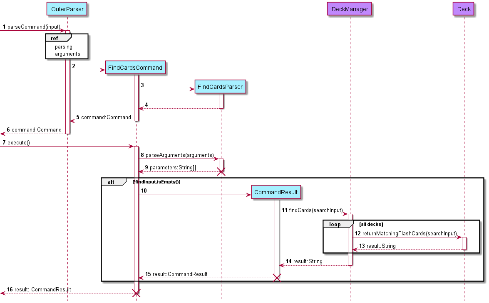

Given above is the sequence diagram of the `find` function. This feature allows users of CardLI to find a
`FlashCard` by providing a search term to the input following the command term `find`. By invoking this function the
user can view specific `FlashCards` matching the search term from the main menu, instead of entering each `Deck` and
manually looking through the list of `FlashCards` for the desired ones.

Currently, `find` is implemented at the Systemwide level. After the `CardLiUi` handles the user input,
`OuterParser` formats the user input and creates a `FindCardsCommand` object which is returned.
`CardLi` calls the `execute()` method of the `FindCardsCommand` object. The `FindCardsParser` extracts the search term(
s) and passes them to `CommandResult` which invokes the  `findCards()`
method of `DeckManager` that repeatedly calls the `returnMatchingFlashCards()` method that iterates once for each
instance of a `Deck`.

`returnMatchingFlashCards()` is implemented by creating a stream that consists of all the `FlashCards` from one deck,
and filters them based on whether they contain the search term given. This method is not case-sensitive. Finally, all
the `FlashCards` that contain the search term are collected in an ArrayList and their console outputs are returned in
string format for `CardLiUi` to display to the user.

### [4.4. Test Feature](#content)

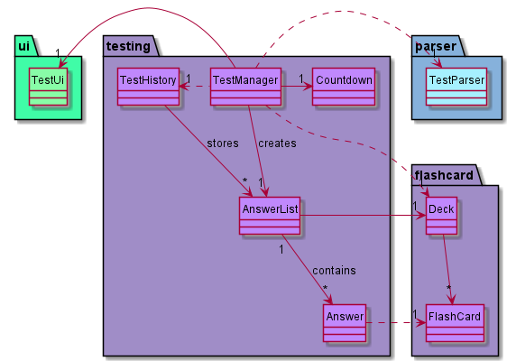

Currently, test feature is implemented at the systemwide level and is handled by `TestManager`.
`TestManager` will call on `TestUi` and `TestParser` to handle the inputs and outputs with the user and the parsing
respectively during the test.

#### [4.4.1. Test Setup](#content)

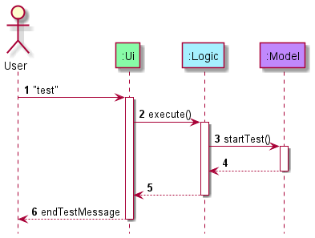

As shown in the sequence diagram above, to enter into test mode, the user needs to enter `test` in the main menu from
which the program will prompt the user to input a number (done in `startTest()`) corresponding to the index of the deck
that they want to be tested on or "all" to test all decks.


In both cases, `TestManager` will create an `AnswerList` using a `Deck` that it creates or gets from
`DeckManager` depending on the condition which is shown by the sequence diagram above. If the user decides to test all
decks, the program will compile all `FlashCards` into a `Deck`. If the user decides to test a single deck, the program
will get that deck instance from `DeckManager`. The `AnswerList` consists of an ArrayList of `Answers` and is where the
user's test responses are stored. The `Deck` to be tested is stored within `AnswerList`.


After constructing the `AnswerList`, the preparation begins. The `Deck` that is attached to the `AnswerList` gets
duplicated, then shuffled. Afterwards, for each question in the test, an `Answer` is initialised with an empty string
and added to `AnswerList`.

#### [4.4.2. Testing Process](#content)

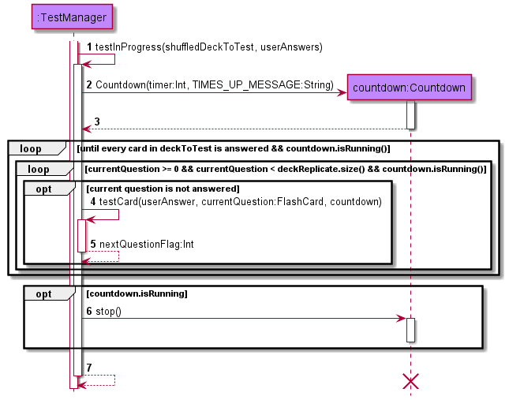

This is where the actual test starts. The user is given a total time of 15s x number of questions to answer all the
questions. The test will keep looping until every card in the `Deck` to test is answered, or until the
`Countdown` timer expires. And there is another loop within that loops until the
`currentQuestion`, which is an `int` representing the question number, goes out of bounds, or until the `Countdown`
timer expires. Inside the inner loop, `testCard` is called to test an individual card. The resulting `nextQuestionFlag`
decides whether to proceed to the next question (if it equals to '0') or go back to a previous question
(if it equals to '1'). If this results in `currentQuestion` going out of bounds and if every question is not answered,
currentQuestion will get reset to either the lowest or highest question number that is not answered.

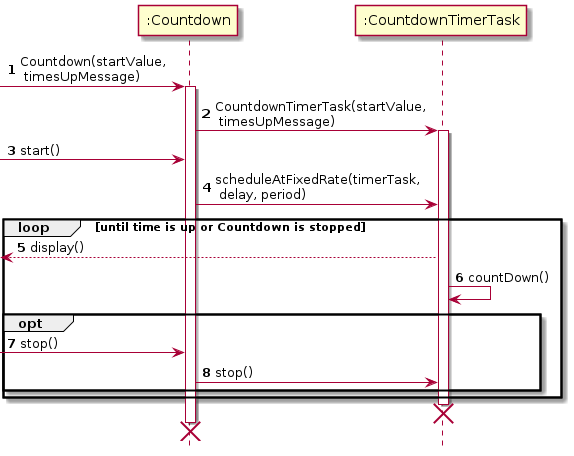
How the `Countdown` class works is shown in the diagram above. When the `Countdown` class is created, it will create a
nested class `CountdownTimerTask` initialised with the `startValue`, or value of time to count down from, and the
`timesUpMessage` that will be printed when the time runs out. Once `Countdown` has been started by calling `start()`,
every second, the time remaining will be printed, then decremented, and the current printed line will be erased and
replaced with the new time remaining. Note, however, that the displaying of the first time remaining will be delayed by
0.1s to allow for the question to be printed first. The loop occurs until the time runs out or `Countdown` has been
stopped by calling `stop()`, which will internally call `cancel()` in `CountdownTimerTask`. If the time runs out,
`CountdownTimerTask` will call the `stop()` method of `Countdown`, which will likewise terminate it.

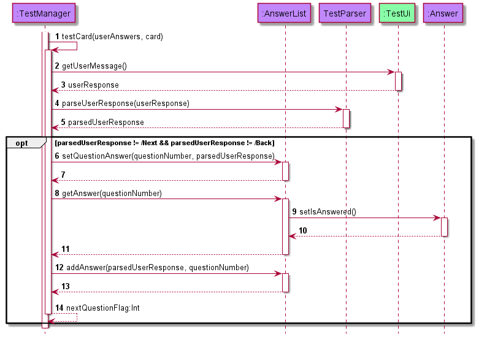

The question is printed for the user to answer. The user's answer is then parsed and checked if it is `/Next` or `/Back`
. If it is neither, the user's answer is added into `AnswerList`. If it is
`/Next`, nextQuestionFlag is set to 0 and if it is `/Back`, nextQuestionFlag is set to 1. If the user has not input an
answer before the countdown timer runs out, the answer for the current question can still be input. However, the answer
stored by the system will be an empty answer and thus will not be counted even if it is correct.

> ! The question will be printed on a new screen. However, if the user scrolls up far enough, the previous inputs can be seen.


After all cards have been tested, the marking process begins as shown by the sequence diagram above. The program prints
the question, followed by the actual answer, followed by the user's answer.

For every correct answer, the `userScore`
and `totalScore` for the `FlashCard` and the `userScore` for the `AnswerList` increments; `TestUi` prints a correct
answer message.

For every wrong answer, the `userScore` for the `FlashCard` and `AnswerList` does not change but the `totalScore` for
the `FlashCard` increments; `TestUi` prints an incorrect answer message.

After all the questions are marked, the user's results are printed and saved in `TestHistory`. This concludes the
entire `startTest()` process.

The `startReview()` process is similar to `startTest()`, except the `getTestDeck()` function has an additional condition
in which only `FlashCards` with `userScore` being strictly less than 50% of `totalScore` are added to the `Deck` to be
reviewed.

<details>
<summary>Remark</summary>

> `TestCommand` and `ReviewCommand` is executed quite differently compared to the other features.
> The other commands return the resulting string of the `execute()` method but ` test` and `review` only return the end
> test/review message.
> This is because, unlike the others, `test` and `review` need to constantly interact with the user,
> which means that the feature needs to print out a response message after the user's input. Furthermore, it needs to
> also update the timer live, which makes storing the entire process as a string
> when `Command.execute()` is called not really feasible.

</details>

### [4.5. Storage](#content)

This feature allows users of CardLI to save data on their current `Decks` of `FlashCards` as well as the tests that they
have completed thus far. This will also allow users to re-access the data when they re-enter the application. This way,
they will not have to keep re-adding the same flashcards, while also being able to review tests that they had previously
done on the application.

This feature is implemented by saving the user’s data into two separate JSON files, which is saved into a new `data`
directory created upon first start up of the application if it does not yet exist. This new directory is created within
the current directory from which the `CardLI.jar` file is run in the CLI. The file paths of the two JSON files are hard
coded as `Cards_CardLI.json` and `Tests_CardLI.json`, which will save data on the user's decks of flashcards and test
history respectively. Whenever the user inputs a new command, the application will execute the save functions after the
actions corresponding to the command are completed. This is done in order to maintain data integrity and accuracy in
case of technical malfunctions that may cause the application to terminate prematurely. When the user restarts or
re-enters the application, the application will parse the JSON files and convert them into the relevant data. The format
of how the data is saved into the JSON files are specified during the development process in order to reduce the risk of
bugs arising when they are being parsed, which will be explained in the following paragraphs.

The `Storage` class contains all the methods to execute the save and parse functions to and from the relevant JSON
files. This `Storage` object is created upon first starting up the application to handle all the method calls. The
respective methods will be explained in more detail in the following paragraphs.

#### [4.5.1. Writing to JSON files](#content)

Two separate methods are used for this feature, namely the ` writeCardsToFile()` and the `writeTestsToFile()` methods.
The two methods save the user's `Decks` of `FlashCards` and `TestHistory` to the JSON files respectively. Since the two
methods are effectively similar in their implementation, the sequence diagram below will suffice in depicting their
execution. For all labels that include a "/", the text before the "/" applies for the `writeCardsToFile()` method while
the text after the "/" applies for the
`writeTestsToFile()` method.


`writeCardsToFile(ArrayList<Deck> decks)`

For the saving of the user's `Decks` of `FlashCards`, the method call will expect an `ArrayList` of `Deck` objects.
The `toJSONObject()` methods within the `Deck`and `FlashCard` classes have been written as per the specified format of
saving the `Decks` of `FlashCards` to the `json` file. Each of the `toJSONObject()` methods returns a formatted JSON
Object containing information about the attributes in each instance of each class, in the form of a map. A combination
of `JSONObject` and `JSONArray` instances are used to format each of the individual attributes, before they are combined
into a single `JSONObject` instance and returned from the method. An example of the format of the `Cards_CardLI.json`
where the `Decks` of `FlashCards` are saved is shown in the image below.

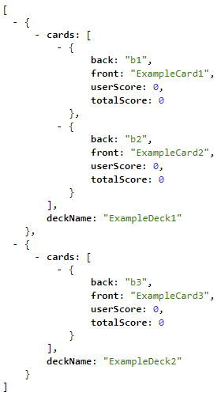

`writeTestsToFile(ArrayList<AnswerList> testHistory)`

For the saving of the user's test history, the method call will expect an `ArrayList` of `AnswerList` objects.
The `toJSONObject()` methods within the `AnswerList`and `Answer` classes have been written as per the specified format
of saving the `TestHistory` to the `json` file. The concept behind the formatting of the returned JSON Object is the
same as that explained under the `writeCardsToFile()` method. An example of the format of the `Tests_CardLI.json` where
the test data is saved is shown in the screenshot below.

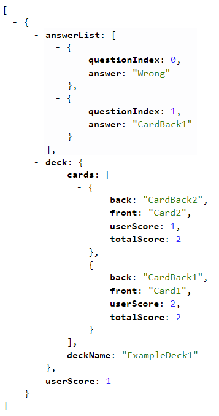

#### [4.5.2. Reading from JSON files](#content)

The methods for reading from the JSON files are executed once upon each startup of the CardLI application. The methods
use an instance of the `Scanner` class to parse through the JSON files, before using an instance of the
`JSONParser` class to parse through the scanned `String` instances and convert them into the relevant `JSONObject`
instances. As per the saving format explained in the "Writing to JSON files" section above, the methods then reverse
engineer the process to convert and add the user's stored data into the application before any commands are given from
the user. Since the implementation of the two methods, namely
`readCardsFromFile()` and `readTestsFromFile()`, are effectively similar in their implementation, the sequence diagram
below will suffice in depicting their execution. For all labels that include a "/", the text before the "/" applies for
the `readCardsFromFile()` method while the text after the "/" applies for the
`readTestsFromFile()` method. The extension to the "ref" box within the sequence diagram will be shown in a separate
sequence diagram in the following sections.

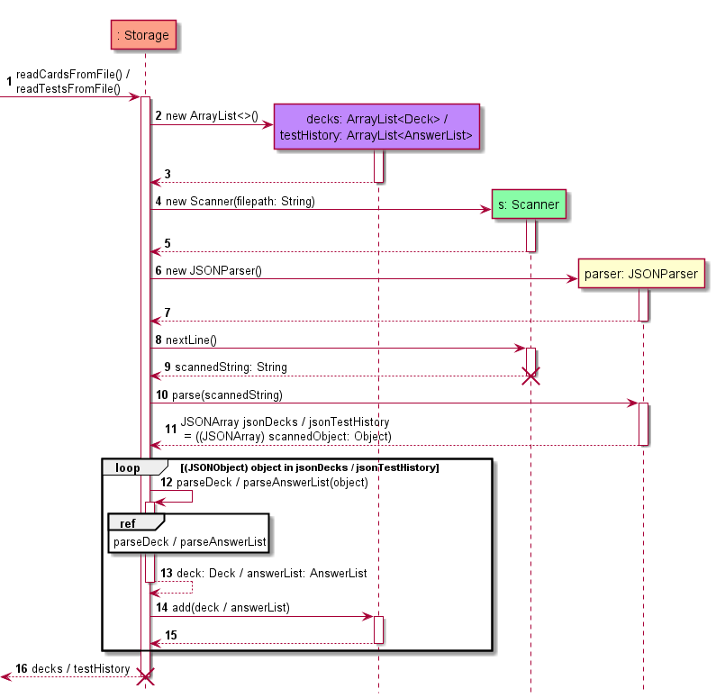

##### [4.5.2.1 `readCardsFromFile`](#content)

The `readCardsFromFile()` method reads from the `Cards_CardLI.json` file. As per the sequence diagram under the
"Reading from JSON files" header, this method calls the `parseDeck(JSONObject jsonDeck)` method iteratively to convert
the saved data into individual `Deck` instances to be added into the application. The sequence diagram depicting the
exact implementation and execute of the `parseDeck(JSONObject jsonDeck)` method is shown below.

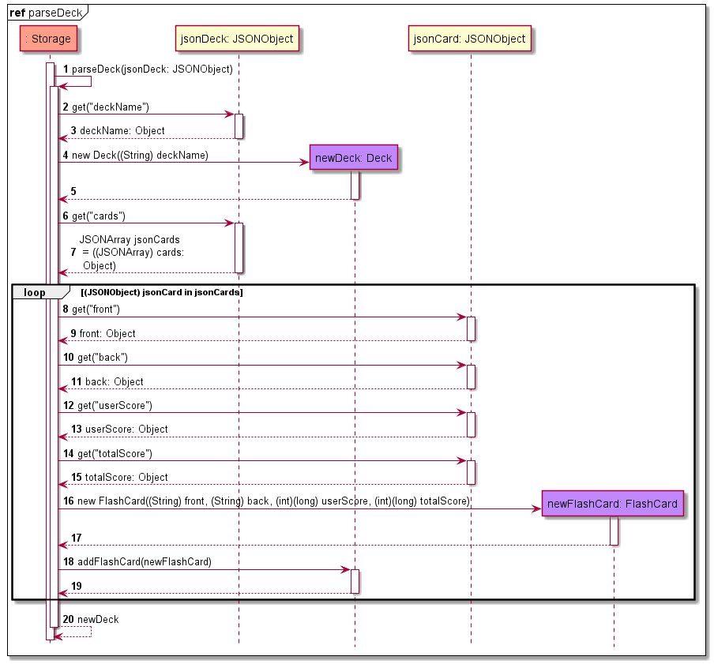

##### [4.5.2.2 `readTestFromFile`](#content)

The `readTestsFromFile()` method reads from the `Tests_CardLI.json` file. As per the sequence diagram under the
"Reading from JSON files" header, this method calls the `parseAnswerList(JSONObject jsonTestHistory)` method iteratively
to convert the saved data into individual `AnswerList` instances to be added into the application. The sequence diagram
depicting the exact implementation and execute of the `parseDeck(JSONObject jsonTestHistory)` method is shown below.


## [5. Product scope](#content)

### [5.1. Target user profile](#content)

* Pre-University/University/Polytechnic students
* Reasonably comfortable using CLI apps
* Types fast
* Prefers to store their information online rather than physically
* Has a lot of flashcards

### [5.2. Value Proposition](#content)

CardLI provides a:
<li> User-friendly </li>
<li> Storage efficient</li>
<li> Internet connection independent flashcard experience. </li>

## [6. User Stories](#content)

|Version| As a ... | I want to ... | So that I can ...|
|--------|----------|---------------|------------------|
|v1.0|new user|see usage instructions|refer to them when I forget how to use the application|
| |user| add flashcards|
| |user| delete flashcards|
| |user| view my flashcards|know what cards I currently have in the deck|
| |user| test myself with my flashcards|know if I have memorised the flashcards correctly|
| |student preparing for their exam|see a list of the flashcards I got wrong|know which concepts I do not know|
|v2.0|user|shuffle my flashcards|test myself with a different order of flashcards each time|
| |student in a hurry|edit my flashcards|change the front or back of a flashcard without deleting and adding it again
| |student who studies multiple subjects|organise my flashcards into different decks|keep flashcards with related topics in the same set|
| |student preparing for their exam|see a timer when in test mode|keep track of how much time I have spent on each question
| |student who wants to test themself|to see the percentage of correct answers for each flashcard|know which cards I am less proficient in
| |student in a hurry|test myself with the flashcards I have answered wrongly for more than half the time|get more proficient at the concepts I am not familiar with
| |student with many flashcards and decks|find a flashcard by searching for a term matching it|find the flashcard without looking through all my decks
| |student with little time|save my flashcards|I do not have to add my flashcards to the app every time I use it

## [7. Non-Functional Requirements](#content)

<li> The app should be usable by someone who is reasonably comfortable using Command Line Interface.</li>
<li> The app should be able to handle at least 25 flashcard decks of at least 25 cards each.</li>
<li> The app should work on a computer that has Java 11 or above installed.</li>
<li> The app should store data in a format that is readable by humans, and easy for machines to parse and generate.</li>

## [8. Glossary](#content)

* *CLI* - Command Line Interface
* *JSON* - JavaScript Object Notation, a lightweight data-interchange format.

## [9. Instructions for Manual Testing](#content)

### [9.1. Main Menu](#content)

> ℹ️ Note: In order to view the JSON files as per the screenshots shown under this section, the respective files
> should be opened on Mozilla Firefox, since it is the only browser that supports the reading and displaying of JSON
> files in the format shown by default. Alternatives to using Mozilla Firefox can also be found [here](https://www.javatpoint.com/how-to-open-json-file).
> It is also possible to open the JSON file using the Notepad application on Windows, or any other Notepad equivalent
> applications on other Operating Systems. However, doing so may make it difficult to read the contents of the file
> as the information will be displayed in a single line.

#### Adding a deck

1. Test case: `add`

   Expected: No deck is added. Error message is printed to prompt user to input the name of the deck after "add".
2. Test case: `add ExampleDeck1`

   Expected: No deck is added. Error message is shown to inform user that the deck name is already in use by another
   deck.
3. Test case: `add ExampleDeck4`

   Expected: Deck is added with the name "ExampleDeck4". Success message is shown.

   Expected JSON output:

   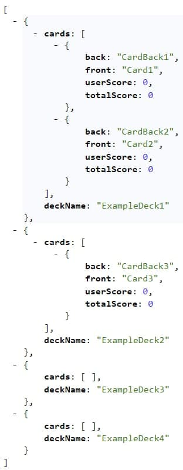

#### Editing a Deck

1. Test case: `edit /d /d /n /n`

   Expected: Error is thrown. Error message indicating that you should not be using command flags as part of the command 
arguments is printed.

2. Test case: `edit /d two /n ExampleDeck5`

   Expected: Error is thrown. Error message indicating that you should only be using positive integer to indicate the deck 
to edit is printed.

3. Test case: `edit /d 2 /n ExampleDeck5`

   Expected: Message is printed, stating the new name of the edited deck and the index of the edited deck

   Expected JSON Output:

   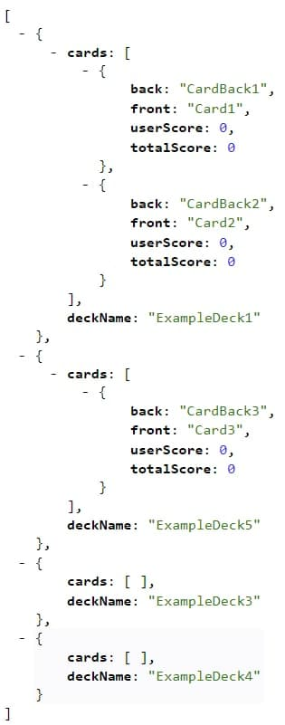

#### Deleting a deck

1. Test case: `delete`

   Expected: Error is thrown. Error message is printed to system output, indicating that an argument for deck index is 
expected for this command.
2. Test case: `delete 10`

   Expected: Error is thrown. Error message is printed to system output, informing the user that the specified deck
index does not exist. 
3. Test case: `delete ExampleDeck3`/`delete -1`

   Expected: Error is thrown. Error message is printed to system output, prompting the user for a positive integer as 
a valid argument for this command. 
4. Test case: `delete 3`

   Expected: Command is executed successfully and deck 3 is deleted from the user's current decks. 
   
   Expected JSON output:

   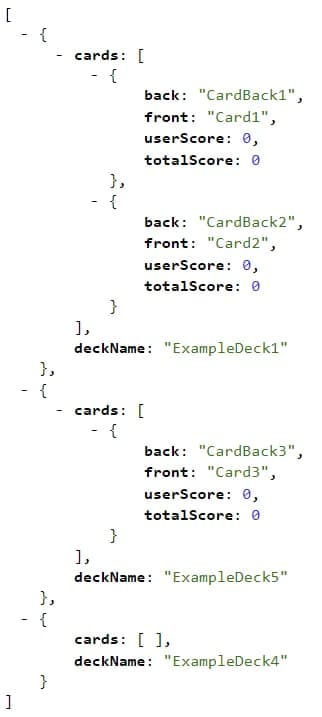

#### Entering a deck

1. Test case: `enter`

   Expected: No deck is entered. Error message is shown to prompt user to input the index of the deck after "enter".
2. Test case: `enter 7`

   Expected: No deck is entered. Error message is shown to inform user that there is no deck with that index.
3. Test case: `enter one`

   Expected: No deck is entered. Error message is shown to inform user that the index of deck must be a positive integer
   smaller than 2147483647.
4. Test case: `enter 1`

   Expected: Deck 1 is entered. Success message is shown.

#### Testing

> ❗️ Please delete and reimport Cards_CardLI.json and Tests_CardLI.json after each step.
> ❗️ An arrow "->" represents a multistep instruction. Progress on to the next step by pressing ENTER on your keyboard.
> ❗️ You may enter CTRL+C anytime to stop the execution of the program. When a test is running, pressing CTRL+C will not 
> save your results.

**Entering Test Mode**
1. Test case: `test` -> `1`
   
   Expected: Test mode is entered. All cards in deck 1 are tested.
2. Test case: `test` -> `0` or `all`

   Expected: Test mode is entered. All cards in all decks are tested.
3. Test case: `test` -> `-1`

   Expected: Error is thrown. Error message indicating that you should only be using non-negative integers or "all" 
to indicate the deck to test is printed.

4. Test case: `test` -> `3`

   Expected: Error is thrown. Error message indicating that there are no cards to test is printed.

**Taking Test**
1. Test case: `test` -> `1` -> answer the questions, within the time limit, as per below:
   * Question: Card1
   
      Answer: CardBack1
   
   * Question: Card2
   
      Answer: Wrong answer
   
   Expected: A timer of 30s starts counting down and runs continuously throughout the duration of the test. 
Answering a question clears the screen and prints the next question.
At the end of the test, a screen similar to the one below appears. 
The questions may appear in a different order. The user is then returned to the main menu.

   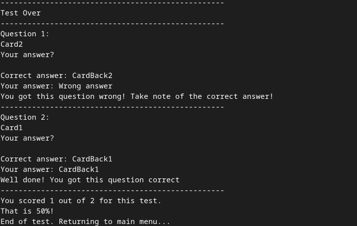

*For the next two steps, enter deck 1 and add a new flashcard by entering `enter 1` -> `add /f Card5 /b CardBack5`.
Exit deck mode by entering `exit`.*

2. Test case: `test` -> `1` -> `/NEXT` or `/BACK`

   Expected: The test progresses onto the next unanswered question upon entering `/NEXT` and moves to the 
previous unanswered question upon entering `/BACK`. If at the last question, upon entering `/NEXT`, the test will wrap 
around to the first unanswered question. If at the first question, upon entering `/BACK`, the test will wrap around to 
the last unanswered question.

3. Test case: `test` -> `1` -> answer the questions according to the following instructions:
   1. Answer the first question with any answer that is not blank.
   2. Input an answer for the second question but do not submit it.
   3. Wait for the time to run out.
   4. Once the time has run out, press ENTER.

   Expected: Only the answer to the first question is graded. The third question is skipped and does not display.
At the end of the test, a screen similar to the one below appears.
The questions may appear in a different order. The user is then returned to the main menu.

   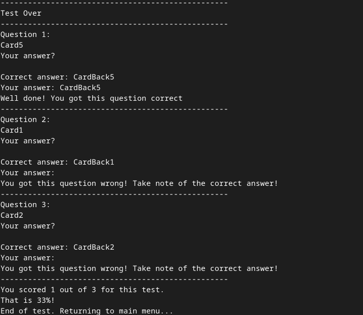

#### Reviewing
> ❗️ Please delete and reimport Cards_CardLI.json and Tests_CardLI.json.

1. Test case: `review` -> `2` or `0` or `all`
   
   Expected: Only one card is tested.

2. Test case: `review` -> `1`

   Expected: Message indicating that there are no low scoring cards to review is printed.

#### Viewing Test and FlashCard Statistics

> ❗️ Please delete and reimport Cards_CardLI.json and Tests_CardLI.json.

1. Test Case: `viewtest invalid`

   Expected: Nothing is displayed. Error message is shown to prompt the user to input a positive integer
   or "all".
2. Test Case: `viewtest all`

   Expected:
   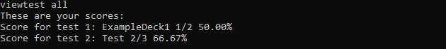
3. Test Case: `viewtest 5`

   Expected: Nothing is displayed. Error message is shown to inform the user that there is no test
   at that index

4. Test Case: `viewfc all`

   Expected: No flashcards are displayed. Error message is shown to inform the user that the command
   does not take in any arguments
5. Test Case: `viewfc`

   Expected:
  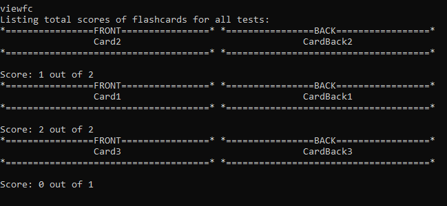

#### Finding flashcards

1. Test Case: `find`

   Expected: No flashcards are displayed. Error message is shown to prompt user to input a search term after "find".
2. Test Case: `find 1`

   Expected: Flashcards should be displayed in the manner shown in the below screenshot.

   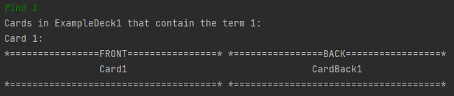

3. Test Case: `find 0`

   Expected: No flashcards are displayed. Message is shown to inform user that there are no cards matching the search
   term.

### [9.2. Deck Mode](#content)

#### Adding a flashcard

1. Prerequisites: Run the command `enter 1`.

2. Test case: `add /f /b`

   Expected: No card is added. Error message is shown to inform user that fields cannot be left empty.
3. Test case: `add /f Card4 /b CardBack4`

   Expected: Card is added with the front "Card4" and back "CardBack4". Success message is shown.

   Expected JSON output:

   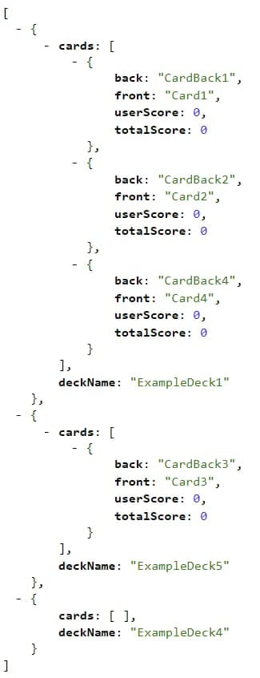

4. Test case: `add /f Card1 /b CardBack1`

   Expected: No card is added. Error message is printed to inform user that there already exists a card with the same
   content on its front. 5.Test case: `add /f card1 /b CardBack1a`

   Expected: Card is added with the front "card1" and back "CardBack1a". Success message is shown.

   Expected JSON output:

   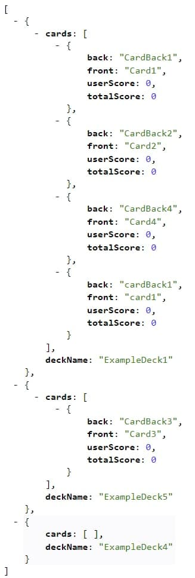

#### Editing a flashcard

1. Test case: `edit /d 1 /j front /e EditedCard1`

   Expected: Error is thrown. Error message indicating that there are missing flags is printed.

2. Test case: `edit /c 1 /s middle /i EditedCard1`

   Expected: Error is thrown. Error message indicating that only "front" or "back" can be entered into the `/s` 
argument.

3. Test case: `edit /c 1 /s front /i EditedCard1`

   Expected: Message is printed, stating the new name of the edited card, the index of the edited card as well as the 
side changed

   Expected JSON Output:

   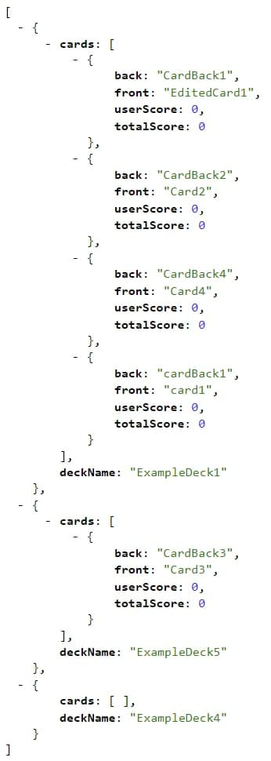

#### Deleting a flashcard

1. Prerequisites: Run the command `enter 1`.

2. Test case: `delete`

   Expected: No card is deleted. Error message is shown to inform user that fields cannot be empty.
3. Test case: `delete one`

   Expected: No card is deleted. Error message is shown to inform user that index of card must be a positive integer
   smaller than 2147483647.
4. Test case: `delete 2`

   Expected: The second card in the deck has been deleted. Success message is shown.

   Expected JSON output:

   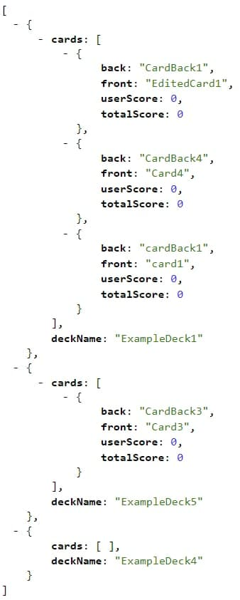

#### Moving a flashcard

1. Test case: `move /c 1 /d -2`

   Expected: Error is thrown. Error message indicating that only positive integers are allowed is printed.

2. Test case: `move /c /d `

   Expected: Error is thrown. Error message indicating that arguments is empty is printed. The command format is printed
as well.
> ❗️ JSON output is based on the edit flashcard test
3. Test case: `move /c 1 /d 2`

   Expected: Message is printed, stating which card was moved to which deck.

   Expected JSON Output:

   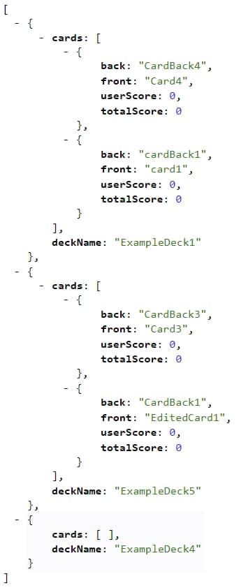
