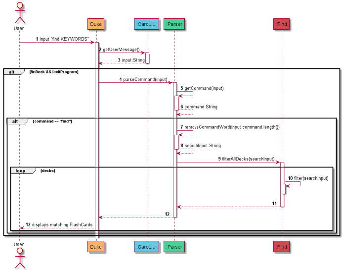

# Developer Guide

#Introduction

CardLI is a Command Line Interface (CLI) desktop app designed to help students manage their flashcards. CardLI can help
students keep track of all their flashcards. It also does tests for students to test their knowledge. All of this in one
single platform.

## Acknowledgements

{list here sources of all reused/adapted ideas, code, documentation, and third-party libraries -- include links to the
original source as well}

## Design
CardLi has one main component, ```Duke```, which is the entry point to the App.

The rest of the App consists of the following components:
* ```Parser```: Interfaces with the user by reading and interpreting input
* ```UI```: The UI of the App
* ```Logic```: The command executor
* ```Storage```: Reads and writes data from and to an external file(s)

Each component is explained in the sections below.


### Parser Component
The Parser component consists of two classes, ```Parser``` and ```TestParser```. Parser deals with input relating to adding, deleting, editing and viewing flashcards and decks, while ```TestParser``` deals with input relating to testing.

How the Parser component works:
* Identifies the command input by the user
* Parses command arguments
* Executes commands using the Logic component
* Handles exceptions relating to invalid arguments

### UI Component
The UI component consists of two classes, ```CardLiUi``` and ```TestUi```. It outputs greeting, exit and help messages to the user on command.

### Logic Component
The Logic component consists of the classes ```DeckManager```, ```Deck```, ```Flashcard```, ```TestManager```, ```AnswerList``` and ```Answer```. It executes user commands by calling on methods in its classes when appropriate with the appropriate arguments as given by the Parser component.

CardLi’s user commands operate on a 2-tier structure: a Systemwide level and a Deck level. The Systemwide level commands execute commands related to the management of decks, while the Deck level commands execute commands related to flashcards in a specific deck. The specific implementations are elaborated on in the *Implementation* section.

### Storage Component
The Storage component:
* Saves all the decks
* Saves all the flashcards
* Remembers which deck each flashcard belongs to
* Saves the results of each test

## Implementation
### Editing a Deck

This subsection provides details on the implementation of the commands that enable the editing of the `Deck` object.

The user can only edit the `name` attribute of the `Deck` object, which represents the name of the deck.

### `EditDeckCommand`
The 'EditDeckCommand' allows the changing of the name of the `Deck`.

Given below is the sequence diagram for `EditDeckCommand`:


### Editing a FlashCard

The 'EditCardCommand' allows the changing of the content of the `FlashCard`. The user can decide to change either the `front`
or `back` attributes of the `FlashCard`object, which represents the front and back side of the card.

Given below is the sequence diagram for `EditCardCommand`:


###Find
<!DOCTYPE html>
<html>

<head>
    <meta charset="utf-8">
    <meta name="viewport" content="width=device-width, initial-scale=1.0">
    <title></title>
</head>

<body>


</body>
<body>
    <p dir="ltr" style="line-height:1.38;margin-top:0pt;margin-bottom:0pt;"><span style="font-size:11pt;font-family:Arial;font-weight:400;font-style:normal;font-variant:normal;text-decoration:none;vertical-align:baseline;white-space:pre;white-space:pre-wrap;">This feature allows users of CardLI to find a&nbsp;</span><span style="font-size:11pt;font-family:Arial;font-weight:700;font-style:normal;font-variant:normal;text-decoration:none;vertical-align:baseline;white-space:pre;white-space:pre-wrap;">FlashCard</span><span style="font-size:11pt;font-family:Arial;font-weight:400;font-style:normal;font-variant:normal;text-decoration:none;vertical-align:baseline;white-space:pre;white-space:pre-wrap;">&nbsp;by providing a search term to the input following the command term `find`. By invoking this function the user can view specific&nbsp;</span><span style="font-size:11pt;font-family:Arial;font-weight:700;font-style:normal;font-variant:normal;text-decoration:none;vertical-align:baseline;white-space:pre;white-space:pre-wrap;">FlashCards</span><span style="font-size:11pt;font-family:Arial;font-weight:400;font-style:normal;font-variant:normal;text-decoration:none;vertical-align:baseline;white-space:pre;white-space:pre-wrap;">&nbsp;matching the search term from the main menu, instead of entering each deck and manually looking through the list of&nbsp;</span><span style="font-size:11pt;font-family:Arial;font-weight:700;font-style:normal;font-variant:normal;text-decoration:none;vertical-align:baseline;white-space:pre;white-space:pre-wrap;">FlashCard</span><span style="font-size:11pt;font-family:Arial;font-weight:400;font-style:normal;font-variant:normal;text-decoration:none;vertical-align:baseline;white-space:pre;white-space:pre-wrap;">&nbsp;for the desired ones.</span></p>
    <p></p>
    <p dir="ltr" style="line-height:1.38;margin-top:0pt;margin-bottom:0pt;"><span style="font-size:11pt;font-family:Arial;font-weight:400;font-style:normal;font-variant:normal;text-decoration:none;vertical-align:baseline;white-space:pre;white-space:pre-wrap;">Currently, &ldquo;Find&rdquo; is implemented on a Systemwide level. After the&nbsp;</span><span style="font-size:11pt;font-family:Arial;font-weight:700;font-style:normal;font-variant:normal;text-decoration:none;vertical-align:baseline;white-space:pre;white-space:pre-wrap;">Ui&nbsp;</span><span style="font-size:11pt;font-family:Arial;font-weight:400;font-style:normal;font-variant:normal;text-decoration:none;vertical-align:baseline;white-space:pre;white-space:pre-wrap;">handles the user input,&nbsp;</span><span style="font-size:11pt;font-family:Arial;font-weight:700;font-style:normal;font-variant:normal;text-decoration:none;vertical-align:baseline;white-space:pre;white-space:pre-wrap;">Parser&nbsp;</span><span style="font-size:11pt;font-family:Arial;font-weight:400;font-style:normal;font-variant:normal;text-decoration:none;vertical-align:baseline;white-space:pre;white-space:pre-wrap;">formats the user input and passes the search term(s) to&nbsp;</span><span style="font-size:11pt;font-family:Arial;font-weight:700;font-style:normal;font-variant:normal;text-decoration:none;vertical-align:baseline;white-space:pre;white-space:pre-wrap;">Find</span><span style="font-size:11pt;font-family:Arial;font-weight:400;font-style:normal;font-variant:normal;text-decoration:none;vertical-align:baseline;white-space:pre;white-space:pre-wrap;">&nbsp;which repeatedly calls the&nbsp;</span><span style="font-size:11pt;font-family:'Courier New';font-weight:700;font-style:normal;font-variant:normal;text-decoration:none;vertical-align:baseline;white-space:pre;white-space:pre-wrap;">filter()</span><span style="font-size:11pt;font-family:Arial;font-weight:400;font-style:normal;font-variant:normal;text-decoration:none;vertical-align:baseline;white-space:pre;white-space:pre-wrap;">&nbsp;method that iterates once for each instance of a deck.</span></p>
    <p></p>
    <p><span style="font-size:11pt;font-family:'Courier New';font-weight:700;font-style:normal;font-variant:normal;text-decoration:none;vertical-align:baseline;white-space:pre;white-space:pre-wrap;">filter()</span><span style="font-size:11pt;font-family:Arial;font-weight:400;font-style:normal;font-variant:normal;text-decoration:none;vertical-align:baseline;white-space:pre;white-space:pre-wrap;">&nbsp;is implemented by creating a stream that consists of all the flashcards in one deck, and filters them based on whether they contain the search term given. Finally all the flashcards that contain the search term are collected in an arrayList to be displayed to the user along with their&nbsp;</span><span style="font-size:11pt;font-family:'Courier New';font-weight:400;font-style:normal;font-variant:normal;text-decoration:none;vertical-align:baseline;white-space:pre;white-space:pre-wrap;">deckIndex</span><span style="font-size:11pt;font-family:Arial;font-weight:400;font-style:normal;font-variant:normal;text-decoration:none;vertical-align:baseline;white-space:pre;white-space:pre-wrap;">&nbsp;and</span><span style="font-size:11pt;font-family:'Courier New';font-weight:400;font-style:normal;font-variant:normal;text-decoration:none;vertical-align:baseline;white-space:pre;white-space:pre-wrap;">&nbsp;cardIndex</span><span style="font-size:11pt;font-family:Arial;font-weight:400;font-style:normal;font-variant:normal;text-decoration:none;vertical-align:baseline;white-space:pre;white-space:pre-wrap;">.</span></p>
</body>


###Test Feature


Currently, test feature is implemented on a systemwide level and is handled by `TestManager`.
`TestManager` will call on `TestUi` and `TestParser` to handle the inputs and outputs with the user
and the parsing respectively during the test.


To enter into test mode, the user needs to enter `test` in main menu in which the program will
prompt the user to input a number corresponding to the index of the deck that they want to 
be tested on or "all" to test all decks.


In both cases, `TestManager` will create an `AnswerList` using a `Deck` that it creates or gets from
`DeckManager` depending on the condition which is shown by the sequence diagram above. 
If the user decides to test all decks, the program will compile all `FlashCard` into a `Deck`. If the user
decides to test a single deck, the program will get that deck instance from `DeckManager`.
The `AnswerList` is where the user's response to the test is stored, and it is made up 
of `Answer` as shown in the class diagram above. The `AnswerList` is also tagged with the test deck.


After initializing the `AnswerList`, the testing begins. The `Deck` gets shuffled, then the cards (question)
will be printed one at a time for the user to answer. The user's answer is then parsed and then added into
the `AnswerList`. This process is repeated for the entire `Deck` that is being tested.


After all cards have been tested, the marking process begins as shown by the sequence diagram above. The
program will print the question, followed by the actual answer, followed by the user's answer.
For every correct answer, the user's score increments and `TestUi` will print a correct answer message.
After marking all the questions, the user's results will be printed and saved in `TestHistory`.
This concludes the entire `starTest()` process.

### Storage

This feature allows users of CardLI to save their current decks of flashcards. This will also allow them to access their 
decks of flashcards when they re-enter the application, and not have to keep re-adding the same flashcards into the 
application over and over again.

This feature is implemented by saving the user’s current decks of flashcards into a separate text file stored within the
same directory as that of the application “jar” file. The filepath of the text file is hard coded as ``data/CardLI.txt``. 
When the user inputs the command ``bye``, the application will take that as a cue to execute the save function. When the 
user restarts or re-enters the application, the application will then read from the same text file to fetch all the 
decks of flashcards that were previously added. The format of how the decks are saved into the text file are specified 
during the development process in order to reduce the risk of bugs arising when the text file is being read. More 
details on the format of how the decks of flashcards are saved will be explained in the following paragraphs.

The methods that implement the save and read functions to and from the text file fall within the ``DeckManager`` class. 
This was done since ``DeckManager`` has direct access to the ``ArrayList`` of all current decks of flashcards.

``saveToFile()``

This method is invoked by calling ``DeckManager.saveToFile()``, when the ``bye`` command is parsed from the user input at the
command line. The ``toString()`` methods within the ``Deck`` and ``Flashcard`` classes have also been overridden as per the 
specified format of saving the decks of flashcards to the text file. For a ``Flashcard`` instance, the ``toString()`` method 
outputs a formatted string: ``<front> | <back> | <userScore> | <totalScore>``. For a ``Deck`` instance, the ``toString()`` 
method also outputs a formatted string containing information about the deck name, the number of flashcards within the 
deck, on top of information on each of the flashcards contained within the deck. An example of the format of the text file 
where the decks of flashcards are saved is shown in the screenshot below.

<!DOCTYPE html>
<html>

<head>
    <meta charset="utf-8">
    <meta name="viewport" content="width=device-width, initial-scale=1.0">
    <title></title>
</head>

<body>


</body>
<body>
    <p dir="ltr" style="line-height:1.38;margin-top:0pt;margin-bottom:0pt;"><span style="font-size:11pt;font-family:Arial;font-weight:400;font-style:normal;font-variant:normal;text-decoration:none;vertical-align:baseline;white-space:pre;white-space:pre-wrap;">This feature allows users of CardLI to find a&nbsp;</span><span style="font-size:11pt;font-family:Arial;font-weight:700;font-style:normal;font-variant:normal;text-decoration:none;vertical-align:baseline;white-space:pre;white-space:pre-wrap;">FlashCard</span><span style="font-size:11pt;font-family:Arial;font-weight:400;font-style:normal;font-variant:normal;text-decoration:none;vertical-align:baseline;white-space:pre;white-space:pre-wrap;">&nbsp;by providing a search term to the input following the command term `find`. By invoking this function the user can view specific&nbsp;</span><span style="font-size:11pt;font-family:Arial;font-weight:700;font-style:normal;font-variant:normal;text-decoration:none;vertical-align:baseline;white-space:pre;white-space:pre-wrap;">FlashCards</span><span style="font-size:11pt;font-family:Arial;font-weight:400;font-style:normal;font-variant:normal;text-decoration:none;vertical-align:baseline;white-space:pre;white-space:pre-wrap;">&nbsp;matching the search term from the main menu, instead of entering each deck and manually looking through the list of&nbsp;</span><span style="font-size:11pt;font-family:Arial;font-weight:700;font-style:normal;font-variant:normal;text-decoration:none;vertical-align:baseline;white-space:pre;white-space:pre-wrap;">FlashCard</span><span style="font-size:11pt;font-family:Arial;font-weight:400;font-style:normal;font-variant:normal;text-decoration:none;vertical-align:baseline;white-space:pre;white-space:pre-wrap;">&nbsp;for the desired ones.</span></p>
    <p></p>
    <p dir="ltr" style="line-height:1.38;margin-top:0pt;margin-bottom:0pt;"><span style="font-size:11pt;font-family:Arial;font-weight:400;font-style:normal;font-variant:normal;text-decoration:none;vertical-align:baseline;white-space:pre;white-space:pre-wrap;">Currently, &ldquo;Find&rdquo; is implemented on a Systemwide level. After the&nbsp;</span><span style="font-size:11pt;font-family:Arial;font-weight:700;font-style:normal;font-variant:normal;text-decoration:none;vertical-align:baseline;white-space:pre;white-space:pre-wrap;">Ui&nbsp;</span><span style="font-size:11pt;font-family:Arial;font-weight:400;font-style:normal;font-variant:normal;text-decoration:none;vertical-align:baseline;white-space:pre;white-space:pre-wrap;">handles the user input,&nbsp;</span><span style="font-size:11pt;font-family:Arial;font-weight:700;font-style:normal;font-variant:normal;text-decoration:none;vertical-align:baseline;white-space:pre;white-space:pre-wrap;">Parser&nbsp;</span><span style="font-size:11pt;font-family:Arial;font-weight:400;font-style:normal;font-variant:normal;text-decoration:none;vertical-align:baseline;white-space:pre;white-space:pre-wrap;">formats the user input and passes the search term(s) to&nbsp;</span><span style="font-size:11pt;font-family:Arial;font-weight:700;font-style:normal;font-variant:normal;text-decoration:none;vertical-align:baseline;white-space:pre;white-space:pre-wrap;">Find</span><span style="font-size:11pt;font-family:Arial;font-weight:400;font-style:normal;font-variant:normal;text-decoration:none;vertical-align:baseline;white-space:pre;white-space:pre-wrap;">&nbsp;which repeatedly calls the&nbsp;</span><span style="font-size:11pt;font-family:'Courier New';font-weight:700;font-style:normal;font-variant:normal;text-decoration:none;vertical-align:baseline;white-space:pre;white-space:pre-wrap;">filter()</span><span style="font-size:11pt;font-family:Arial;font-weight:400;font-style:normal;font-variant:normal;text-decoration:none;vertical-align:baseline;white-space:pre;white-space:pre-wrap;">&nbsp;method that iterates once for each instance of a deck.</span></p>
    <p></p>
    <p><span style="font-size:11pt;font-family:'Courier New';font-weight:700;font-style:normal;font-variant:normal;text-decoration:none;vertical-align:baseline;white-space:pre;white-space:pre-wrap;">filter()</span><span style="font-size:11pt;font-family:Arial;font-weight:400;font-style:normal;font-variant:normal;text-decoration:none;vertical-align:baseline;white-space:pre;white-space:pre-wrap;">&nbsp;is implemented by creating a stream that consists of all the flashcards in one deck, and filters them based on whether they contain the search term given. Finally all the flashcards that contain the search term are collected in an arrayList to be displayed to the user along with their&nbsp;</span><span style="font-size:11pt;font-family:'Courier New';font-weight:400;font-style:normal;font-variant:normal;text-decoration:none;vertical-align:baseline;white-space:pre;white-space:pre-wrap;">deckIndex</span><span style="font-size:11pt;font-family:Arial;font-weight:400;font-style:normal;font-variant:normal;text-decoration:none;vertical-align:baseline;white-space:pre;white-space:pre-wrap;">&nbsp;and</span><span style="font-size:11pt;font-family:'Courier New';font-weight:400;font-style:normal;font-variant:normal;text-decoration:none;vertical-align:baseline;white-space:pre;white-space:pre-wrap;">&nbsp;cardIndex</span><span style="font-size:11pt;font-family:Arial;font-weight:400;font-style:normal;font-variant:normal;text-decoration:none;vertical-align:baseline;white-space:pre;white-space:pre-wrap;">.</span></p>
</body>

``readFromFile()``

The method is invoked by calling ``DeckManager.readFromFile()``, and is executed every time the CardLI 
is opened. Upon first boot, the specified text file might not yet exist, and hence, the application will 
treat the current list of decks of flashcards as empty. The method uses an instance of ``Scanner`` to parse 
through the text file. As per the saving format explained in the ``saveToFile()`` method above, the 
``readFromFile()`` method essentially reverse engineers the process. Using the above screenshot as an 
example, Line 1 denotes the number of decks that should be expected in the subsequent lines of the text 
file. Line 2 denotes the name of the first deck of flashcards, while Line 3 denotes the number of 
flashcards to be expected in the deck named “ExampleDeck1”, which will be parsed as an integer by the 
application. Lines 5-6 represent information about the 2 flashcards that are in “ExampleDeck1”. This same
procedure can be used to parse the second deck named “ExampleDeck2” from the remaining lines of the text file.


## Product scope

### Target user profile

* Pre-University/University/Polytechnic students
* Reasonably comfortable using CLI apps
* Types fast
* Prefers to store their information online rather than physically
* Has a lot of flashcards


### Value proposition

CardLI provides a:
<li> User-friendly </li>
<li> Storage efficient</li>
<li> Internet connection independent</li>
flashcard experience.

## User Stories

|Version| As a ... | I want to ... | So that I can ...|
|--------|----------|---------------|------------------|
|v1.0|new user|see usage instructions|refer to them when I forget how to use the application|
| |user| add flashcards|
| |user| delete flashcards|
| |user| view my flashcards|know what cards I currenly have in the deck|
| |user| test myself with my flashcards|know if I have memorised the flashcards correctly|
| |student preparing for their exam|see a list of the flashcards I got wrong|know which concepts I do not know|
|v2.0|user|shuffle my flashcards|test myself with a different order of flashcards each time|
| |student in a hurry|edit my flashcards|change the front or back of a flashcard without deleting and adding it again
| |student who studies multiple subjects|organise my flashcards into different decks|keep flashcards with related topics in the same set|
| |student preparing for their exam|see a timer when in test mode|keep track of how much time I have spent on each question
| |student who wants to test themself|to see the percentage of correct answers for each flashcard|which cards I am less proficient in
| |student in a hurry|test myself with the flashcards I have answered wrongly for more than half the time|get more proficient at the concepts I am not familiar with
| |student with many flashcards and decks|find a flashcard by searching for a term matching it|find the flashcard without looking through all my decks
| |student with little time|save my flashcards|I do not have to add my flashcards to the app every time I use it

## Non-Functional Requirements

{Give non-functional requirements}

## Glossary

* *glossary item* - Definition

## Instructions for manual testing

{Give instructions on how to do a manual product testing e.g., how to load sample data to be used for testing}
