# User Guide

## Introduction

CardLI is a desktop app that helps you create, organise, and review flashcards via a Command Line Interface. As students
ourselves, we find that studying through the use of flashcards can greatly increase the efficacy of our study sessions
as they break down large chapters and concepts into easy-to-understand segments. Hence, CardLI was designed in order to
help students study better through the use of flashcards, while also reducing the paper waste that goes into writing
physical flashcards. The interfacing within the application is designed to be interactive and functional, while the
commands are designed to be intuitive to use.

## How To Use

This guide helps you to get familiarised with all the features of CardLI. The [Quick Start](#quick-start)
section tells you how to download and get CardLI set up. The [Features](#features) section provides an in-depth
description of all available features, which you can refer to for the exact definitions.
The [Command Summary](#4-command-summarycontent) section gives you a brief overview of the format of all commands in
table format to let you check the format of commands at glance. To make it easier for you to navigate,
the [contents](#content) is linked to their respective sections.

## Quick Start

1. Ensure that you have Java 11 or above installed.
2. Download the latest version of `CardLI.jar` from [here](http://link.to/duke).
3. Take note of the full filepath of directory in which `CardLI.jar` is saved.
4. Open the command prompt by searching `cmd` in the search bar.
5. Navigate to the file directory containing `CardLI.jar` using the command `cd <filepath>`.
6. Start up CardLI using the command``java -jar CardLI.jar`.

> ❗ The above steps are for users who are running CardLI on a Windows device. If you are using a macOS or Linux device, you will have to open the command prompt equivalent on your operating system in step 4. Subsequently, you will also have to use the equivalent command on your operating system for navigation to a file directory in step 5. The remaining steps are the same across all operating systems.
>
> ❗ The timer feature is not supported on macOS or other environments that do not support ANSI.

The expected output upon startup of the app is shown below:
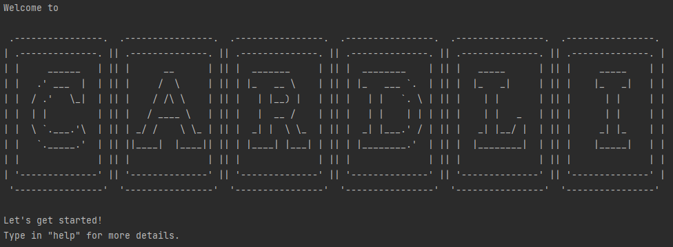
## Features

The current version of CardLI has two menus: main and deck. In the main menu, you are working with all the decks, so
commands only apply to the decks and not the individual flashcards. Enter the deck menu to work with the flashcards.

### Content

1. [Main Menu](#1-main-menu) 
   1.1 [Add Deck](#11-adding-a-deck-add) 
   1.2 [Edit Deck](#12-editing-a-deck-edit) 
   1.3 [Delete Deck](#13-deleting-a-deck-delete) 
   1.4 [Enter Deck](#14-entering-a-deck-enter) 
   1.5 [Test](#15-test-flashcards-test) 
   1.6 [Review](#16-review-flashcards-review) 
   1.7 [View Decks](#17-viewing-all-decks-view) 
   1.8 [View Flashcard Stats](#18-view-flashcard-statistics-viewfc) 
   1.9 [View Test Stats](#19-view-test-statistics-viewtest) 
   1.10 [Find Flashcard](#110-finding-a-flashcard-find) 
   1.11 [Help](#111-listing-all-commands-help) 
   1.12 [Exit App](#112-exiting-the-app-bye) 
2. [Deck Menu](#2-deck-menu) 
   2.1 [Add Flashcard](#21-adding-a-flashcard-add) 
   2.2 [Edit Flashcard](#22-editing-a-flashcard-edit) 
   2.3 [Delete Flashcard](#23-deleting-a-flashcard-delete) 
   2.4 [Move Flashcard](#24-moving-a-flashcard-move) 
   2.5 [View Flashcard](#25-viewing-flashcards-view) 
   2.6 [Help](#26-listing-all-commands-in-deck-mode-help) 
   2.7 [Exit Deck Mode](#27-exiting-deck-mode-exit) 
3. [FAQ](#3-faqs) 
4. [Command Summary](#4-command-summary) 
   4.1 [Main Menu](#41-main-menu) 
   4.2 [Deck Menu](#42-deck-menu) 

---

## [1. Main Menu](#content)

> 💾 Your decks are saved after each command.

### [1.1 Adding a deck: `add`](#content)

Begin your CardLI journey with `add`. With `add`, create a new deck with the given name, if it does not already exist.
> ❗ Names of decks are case-sensitive.

Format: `add <name of deck>`

Example of Usage:

`add English vocab`

Expected outcome:

### [1.2 Editing a deck: `edit`](#content)

If you ever find a better name for your deck, `edit` allows you to modify the name of your deck. A deck can be chosen
through its index.

In the command, `/d` denotes the index of the deck to be edited and `/n` denotes the new name of the deck.

Format: `edit /d <index of deck> /n <name>`

Example of Usage:

`edit /d 1 /n mathematics`

Expected outcome:

### [1.3 Deleting a deck: `delete`](#content)

If you no longer need a deck, `delete` allows you to delete the deck indicated by the index.

Format: `delete <index of deck>`

Example of Usage:

`delete 1`

Expected outcome:

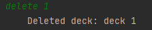

### [1.4 Entering a deck: `enter`](#content)

If you wish to add, delete, edit or view flashcards, `enter` allows you to select a deck to perform these actions on.
Details on Deck Mode can be found [here](#2-deck-menu).

Format:
`enter <index of deck>`

Expected outcome:

### [1.5 Test flashcards: `test`](#content)

If you wish to test your knowledge on your flashcards, use `test` to enter test mode. The program will ask you to input
the index for the deck that is to be tested. The word to be tested will be displayed in the console. A timer will start 
running, which will start from the time 15s * number of flashcards tested. Typing the exact
character-for-character definition for the word will result in a correct answer. Otherwise, the response will be marked
as incorrect. Regardless of whether the answer is correct or incorrect, the console will then display the next word to
be tested. If the time runs out, your answer for the current question will not be saved, and all the other questions 
will be skipped. When all cards in the deck have been tested or the time has run out, the percentage of correct answers 
will be displayed in the
console, as well as the cards which received incorrect responses.

If you do not know the answer to the current question being tested, and you want to skip to another question, you can do
so by typing `/NEXT` or `/BACK` when prompted with the test question.

`/NEXT` will skip to the next question while `/BACK` will go back to the previous question tested.
> ❗ Test data is not saved until a test is complete. If the program crashes mid-test, the data for that test will not be saved.

Format: `test`

Expected outcome:

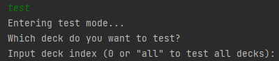

### [1.6 Review flashcards: `review`](#content)

If you wish to review the flashcards you are scoring wrongly more often, use `review` to enter review mode, which is the
same as test mode except that the cards tested will be the cards that you got wrong on more than 50% of the tests.

Format: `review`

Expected outcome:

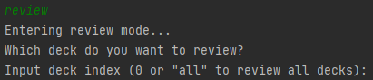

### [1.7 Viewing all decks: `view`](#content)

If you wish to see all your decks at a glance, use `view` to display the names of all decks.

Format: `view`

Expected outcome:

### [1.8 View flashcard statistics: `viewfc`](#content)

If you wish to know the overall scores of your flashcards, `viewfc`  displays all flashcards that have been added up to
this point, including the cumulative score of all tests done for each of the flashcards.

Format: `viewfc`

Expected outcome:

### [1.9 View test statistics: `viewtest`](#content)

If you wish to know how well you did on each of your tests, `viewtest` displays the results for a particular test index
or for all tests, depending on the argument that follows the `viewtest`command.

Format: `viewtest <index of test>` or `viewtest all`

Expected outcome:

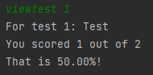
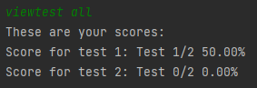

### [1.10 Finding a flashcard: `find`](#content)

If you wish to find a certain flashcard, `find` returns all flashcards with descriptions containing the search terms are
displayed on the screen.

> ℹ️ Search terms are not case-sensitive.

Format: `find <search terms>`

Expected outcome:

### [1.11 Listing all commands: `help`](#content)

If you wish to check the format of a command, `help` lists all commands within the main menu.

Format: `help`

Expected outcome:

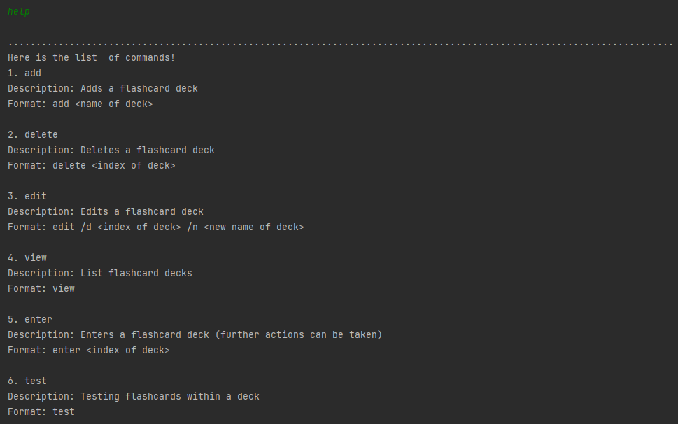

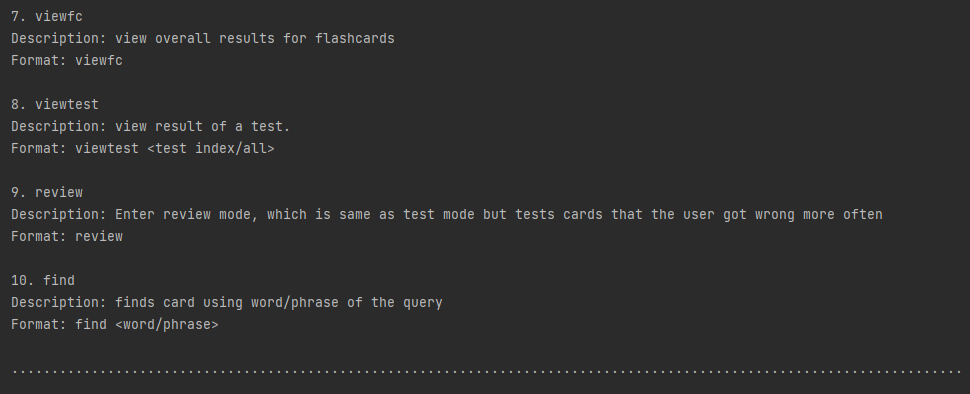

### [1.12 Exiting the app: `bye`](#content)

When you are done using CardLI, `bye` exits the CardLI application within the Command Line Interface.

Format: `bye`

Expected outcome:

---

## [2. Deck Menu](#content)

> 💾 Your flashcards are saved after each command.

### [2.1 Adding a flashcard `add`](#content)

Begin your flashcard journey with `add`. Adds a flashcard with the given front and back to the current deck.

> ❗ You cannot add a flashcard if the content on its front matches the front of an existing flashcard anywhere in the app character-for-character.

Format: `add /f <word/phrase on front of flashcard> /b <word/phrase on back of flashcard>`

Example of usage:
` add /f glycerol /b C3H8O3`

Expected outcome:

### [2.2 Editing a flashcard: `edit`](#content)

Did you accidentally make a mistake in the content of a flashcard? `edit` allows you to modify either the front or back
side of a flashcard. This is so that you do not have to resort to deleting and adding a new flashcard.

In the `edit` command, `/c` denotes the card index, `/s` denotes the side of the flashcard to edit and`/i` denotes the
content you want to change the flashcard to.

> ❗ You cannot edit the front of a flashcard if the resulting flashcard front matches the front of an existing flashcard anywhere in the app character-for-character.

Format: `edit /c <index of card> /s <front or back> /i <input>`

Example of usage:

`edit /c 1 /s front /i 1 + 1`

Expected outcome:

### [2.3 Deleting a flashcard: `delete`](#content)

No longer need a flashcard? `delete` removes the flashcard indicated by the index.

Format: `delete <index of card>`

Example of usage:

`delete 1`

Expected outcome:

### [2.4 Moving a flashcard: `move`](#content)

`move` is useful when you accidentally added a flashcard to the wrong deck. You can transfer the card to another deck
without going through the hassle of deleting the card and adding the same card to another deck.

`move ` moves a flashcard from the deck you are currently in to a deck of your choice, if it exists.

In this command, `/c` denotes the card index and `/d` denotes the deck index or the name of the deck you want to move
the card to.

Format: `move /c <index of card> /d <index of deck>`

Example of usage:

`move /c 1 /d 2`

Expected outcome:

* Deck 2 before moving
  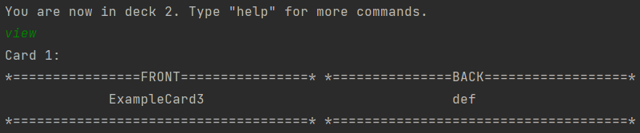

* Deck 1 before and after moving; Deck 2 after moving
  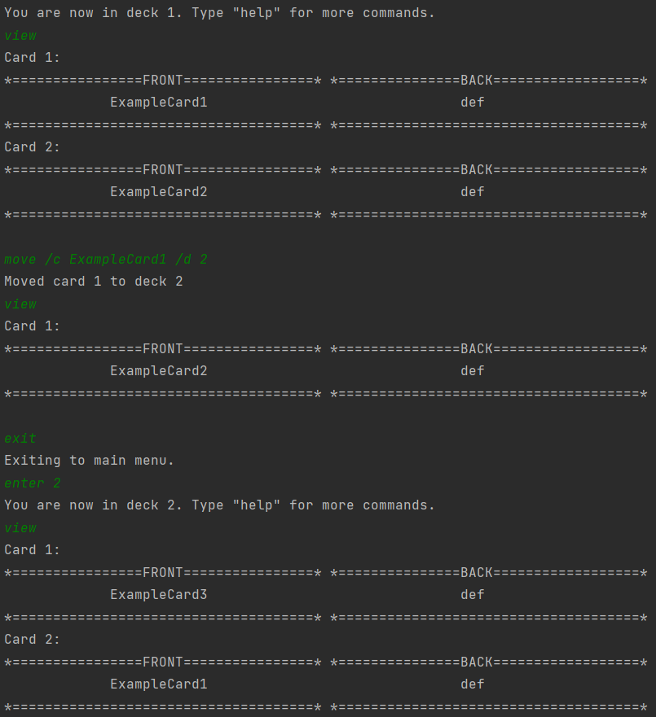

### [2.5 Viewing flashcards: `view`](#content)

`view` lets you look at all the flashcards in the current deck at a glance. Displays all the flashcards in the current
deck.

Format: `view`

Expected outcome:

### [2.6 Listing all commands in deck mode: `help`](#content)

Did you forget the format of a command? `help` lists all commands within Deck Mode.

Format: `help`

Expected outcome:

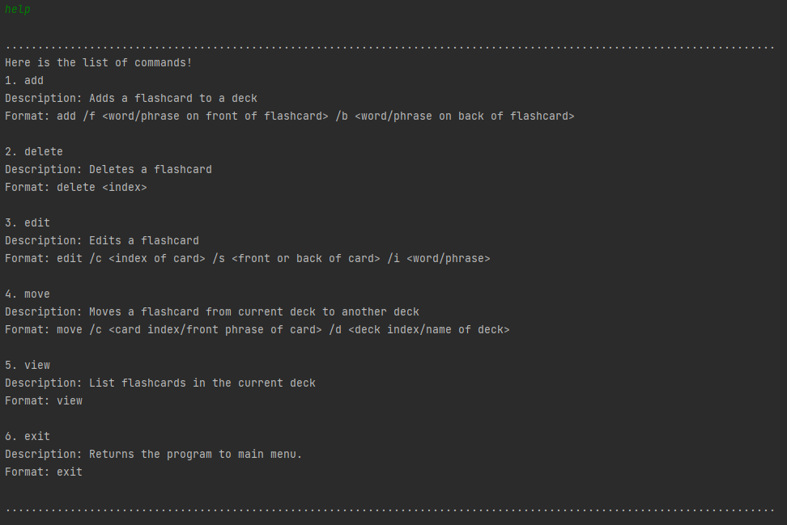

### [2.7 Exiting deck mode: `exit`](#content)

When you are done taking actions within a deck, `exit` lets you exit deck mode and returns you to the main menu.

Format: ``exit``

Expected outcome:

## [3. FAQs](#content)

**Q**: How do I transfer my data to another computer?

**A**: In order to transfer your app data to another computer, simply transfer the `data` file directory to your other
computer, and download the latest version of CardLI there. The `data` file directory should contain both
the `Cards_CardLI.json` and `Tests_CardLI.json` files. Ensure that both the `data` file directory and `CardLI.jar` file
are in the **same directory** before running the CardLI application in the command prompt as instructed under the Quick
Start section.

**Q**: Can I directly edit the storage JSON files to make changes to my saved data?

**A**: We highly recommend that users who are unfamiliar with the workings of JSON and the format of the saved data do
not attempt to directly edit the storage JSON files. This is because the CardLI application has been programmed to read
a specified format from the JSON files. Any inaccuracies arising from the direct editing of the files will likely lead
to undesirable consequences such as bugs and possible loss of your saved data if the files cannot be reverted to their
original format. Nonetheless, it is still possible to directly make edits to the storage JSON files if you are confident
in maintaining the format integrity of the files.

## [4. Command Summary](#content)

### [4.1 Main Menu:](#content)

|Action|Format|
|-------|------|
|add deck|`add <name of deck>`|
|edit deck|`edit /d <index of deck> /n <name>`|
|delete deck|`delete <index>`|
|enter deck|`enter <index of deck>`|
|test|`test`|
|review|`review`|
|view decks|`view`|
|view overall statistics for flashcards|`viewfc`|
|view test statistics|`viewtest <index of test>` prints the result of the test indicated by the index. `viewtest all` prints the results for all tests.|
|find flashcard|`find <word/phrase>`|
|lists all commands in main menu|`help`|
|exiting program|`bye`|

### [4.2 Deck Menu:](#content)

|Action|Format|
|------|------|
|add flashcard|`add /f <word> /b <definition>`|
|editing a flashcard|`edit /c <index of card> /s <front or back> /i <input>`|
|deleting a flashcard|`delete <index of card>`|
|moving a flashcard| `move /c <index of card> /d <index of deck>`|
|viewing flashcards|`view`|
|lists all commands in deck mode|`help`|
|exiting deck mode|`exit`|

