# User Guide

## Introduction

CardLI is a desktop app to help you create, organising, and review flashcards via a Command Line 
Interface. As students ourselves, we find that studying through the use of flashcards can greatly
increase the efficacy of our study sessions as they break down large chapters and concepts into 
easy-to-understand segments. Hence, CardLI was designed in order to help students study better 
through the use of flashcards, while also reducing the paper waste that goes into writing our physical
flashcards. The interfacing within the application has been design to be interactive and functional,
while the commands were designed to be intuitive to use. 

## Quick Start

1. Ensure that you have Java 11 or above installed.
2. Down the latest version of `CardLI.jar` from [here](http://link.to/duke).
3. Take note of the full filepath of directory in which `CardLI.jar` is saved.
4. Open the command prompt by searching `cmd` in the search bar.
5. Navigate to the file directory containing `CardLI.jar` using the command `cd <filepath>`.
6. Start up CardLI using the command``java -jar CardLI.jar`.

The above steps are for users who are running CardLI on a Windows device. If you are using an Apple
and Linux device, you will have to open the command prompt equivalent on your operating system in step 4. 
Subsequently, you will also have to use the equivalent command on your operating system for 
navigation to a file directory in step 5. The remaining steps are the same across all operating systems.

## Features 
The current version of CardLI has two menus: main and deck. In the main menu, you are working with
all the decks, so commands only apply to the decks and not the individual flashcards. Enter the deck
menu to work with the flashcards.

### Content
1. [Main Menu](#main-menu)
2. [Deck Menu](#deck-menu)

---

## Main Menu
### Adding a deck: `add`
Creates and adds a new deck with the given name, if it does not already exist.

Format: `add <name of deck>`

Example of Usage:

`add English vocab`

Expected outcome:

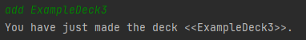
### Viewing all decks: `view`

Displays the names of all decks.

Format: `view`

Expected outcome:

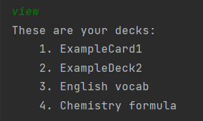
### Editing a deck: `edit`
Edits the name of the deck indicated by the index.
`/d` denotes the index of the deck to be edited and `/n` denotes the new name
of the deck.

Format: `edit /d <index> /n <name>`

Example of Usage:

`edit /d 1 /n mathematics`

Expected outcome:

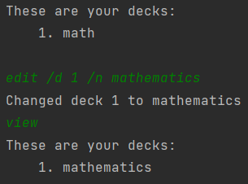
### Deleting a deck: `delete`
Deletes the deck indicated by the index or the name.

Format: `delete <index/name of deck>`

Example of Usage:

`delete 1`

`delete test`

Expected outcome:

### Entering a deck: `enter`
Enters the deck with the given index.

Example of Usage:

Expected outcome: 

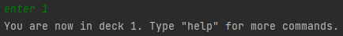
### Testing flashcards within a deck: `test`

Enter test mode. The program will ask you to input the index for the deck that is to be tested.
The word to be tested will be displayed in the console. 
Typing the exact character-for-character definition for the word will result in a correct answer. 
Otherwise, the response will be marked as incorrect. Regardless of whether the answer is correct 
or incorrect, the console will then display the next word to be tested. When all cards in the deck 
have been tested, the percentage of correct answers will be displayed in the console, as well as the 
cards which received incorrect responses.

Format: `test`

Expected outcome:

### View flashcard statistics: `viewfc`
Prints out all flashcards that have been added up to this point, including the cumulative score of
all tests done for each of the flashcards.

Format: `viewfc`

Expected outcome:

### View test statistics: `viewtest`
Prints the results for a particular test index or for all tests, depending on argument that 
follows the `viewtest` command.

Format: `viewtest <index>` or `viewtest all`

Expected outcome:

### Review flashcards: `review`
Enter review mode, which is the same as test mode except that the cards tested will be the cards
that the user got wrong on more than 50% of the tests.

Format: `review`

Expected outcome:

### Finding a flashcard: `find`
Flashcards with descriptions matching the search terms are displayed on the screen.

Format: `find <search terms>`

Expected outcome:

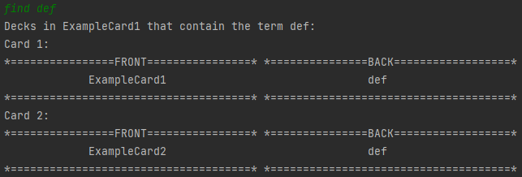
### Exiting the app: `bye`
Exits the CardLI application within the Command Line Interface.
Using this command will also save the current decks of flashcards into a text file named ``CardLI.txt``
stored within the same directory as `Duke.jar`.

Format: `bye`

Expected outcome:

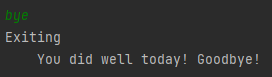
---
## Deck Menu

### Adding a flashcard `add`
Adds a flashcard with the given front and back to the current deck.
Format: `add /f <word/phrase on front of flashcard> /b <word/phrase on front of flashcard>`

Example of usage:
` add /f glycerol /b C3H8O3`

Expected outcome:

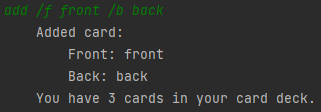

### Deleting a flashcard: `delete`
Format: `delete <word/phrase/index>`
Deletes the flashcard indicated by the index or the flashcard which front matches <word/phrase> if it 
exists in the current deck of flashcards.

Format: `delete <word/phrase/index>`

Remark:
* If there are cards with identical front description in the deck, the first instance of the card 
matching that <word/phrase> will be deleted.

Example of usage:

`delete 1`

`delete card`

`delete sequence diagrams`

Expected outcome:

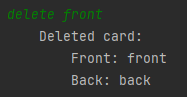
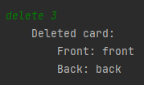
### Editing a flashcard: `edit`
Edits the front or the back of your chosen flashcard to your given input.
`/c` denotes the card index, `/s` denotes the side of the flashcard to edit and
`/i` denotes the content you want to change the flashcard to.

Format: `edit /c <index> /s <front or back> /i <input>`

Example of usage:

`edit /c 1 /s front /i 1 + 1`

Expected outcome:

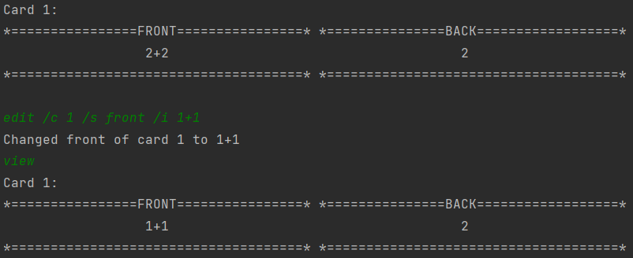
### Viewing flashcards: `view`
Displays all the flashcards in the current deck.

Format: `view`

Expected outcome:

Expected outcome:

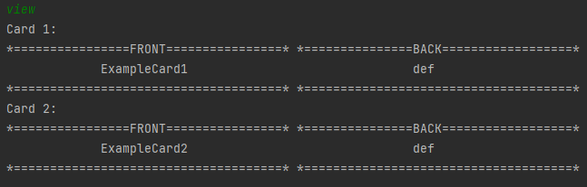
### Exiting deck mode: ``exit``
Exits deck mode and returns to the main menu.

Format: ``exit``

Expected outcome:

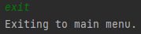
## FAQs

**Q**: How do I transfer my data to another computer? 

**A**: In order to transfer the data on your decks of flashcards to another computer, simply transfer
the `CardLI.txt` file to your other computer, and download the latest version of CardLI there. 
Ensure that both the `CardLI.txt` and `CardLI.jar` files are in the **same directory** before running
the CardLI application in the command prompt as instructed under the Quick Start section. 

**Q**: Can I directly edit the `CardLI.txt` file to add, edit or delete decks and flashcards?

**A**: If you are familiar with the format of how the decks and flashcards are saved within the text
file, you are free to do so. However, if errors are generated upon the next start up of the CardLI 
application, you are advised to revert all changes to the text file and make the necessary changes
from within the application. We will only recommend this method if you are a veteran user and have a
good grasp of the application.

## Command Summary

### Main Menu:

|Action|Format|
|-------|------|
|add deck|`add <name of deck>`|
|view decks|`view`|
|edit deck|`edit /d <index of deck> /n name`|
|delete deck|`delete <index/name of deck>`|
|enter deck|`enter <index of deck>`|
|test|`test`|
|view overall statistics for flashcards|`viewfc`|
|view test statistics|`viewtest <index of test>` prints the result of the test indicated by the index. `viewtest all` prints the results for all tests.|
|review|`review`|
|find flashcard|`find <word/phrase>`|
|exiting program|`bye`|

### Deck Menu:

|Action|Format|
|------|------|
|add flashcard|`add /f <word> /b <definition>`|
|deleting a flashcard|`delete <word/index>`|
|editing a flashcard|`edit /c <index> /s <front or back> /i input`|
|viewing flashcards|`view`|
|exiting deck mode|`exit`|

